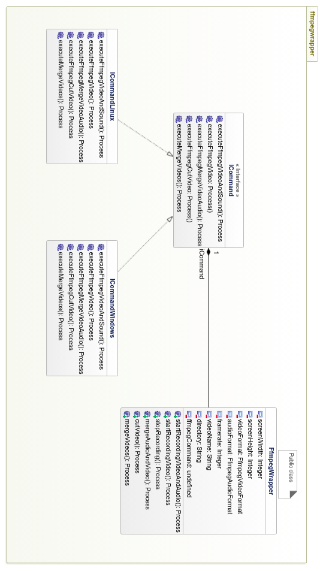
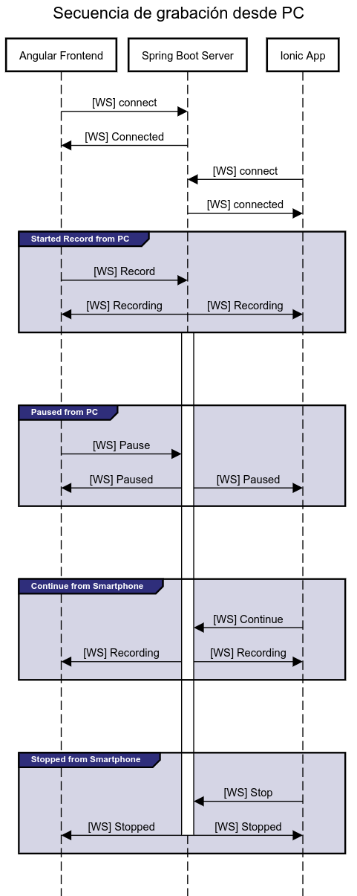

\pagenumbering{Roman}
\pagebreak
&nbsp;
\newpage

\begin{flushright}
\textit{Dedico este trabajo a mis padres por su apoyo y dedicación,} \\
\textit{a mis tutor de proyecto Micael Gallego,} \\
\textit{y a todas los amigos que sin darme cuenta} \\
\textit{han estado ahí}.
\end{flushright}

\newpage
&nbsp;

\tableofcontents

\pagebreak
&nbsp;
\newpage

\pagebreak
&nbsp;
\newpage

# Resumen {-}

A lo largo del presente proyecto, se expondrá el desarrollado de la aplicación *Class Recorder*, la cual, su premisa y objetivo principal, es optimizar el tiempo invertido en la grabación, edición y distribución de clases impartidas con un ordenador.

En el primer y segundo capítulo expondremos el problema general que se presenta en la actualidad, y que proponemos nosotros con nuestra aplicación, y un flujo de trabajo con el que mejorarlo a través de esta.

En el tercer capítulo expondremos las tecnologías, herramientas y metodologías aplicadas al proyecto, donde mencionaremos también una técnica que hemos utilizado para realizar el proyecto automatizando la configuración del entorno de desarrollo y como se ha escrito esta memoria utilizando Markdown. Mencionaremos por supuesto las tecnologías también aplicadas al proyecto principal, por qué hemos escogido Spring Boot, Angular, Ffmpeg, Ionic y que ventajas ofrece cada una con respecto a otras, etc.

En el cuarto capítulo correspondiente a la descripción informática ahondaremos en temas más técnicos e introduciremos en un primer lugar los requisitos previos de nuestra aplicación. A partir de esos requisitos, describiremos una arquitectura software y el diseño de las partes más importantes. Este diseño será posteriormente utilizado como base de abstracción para implementar nuestra aplicación. Las partes más importantes de ésta serán también explicadas en detalle a nivel de código. Por ultimo para finalizar este capítulo abordaremos que partes están testeadas de la aplicación.

Finalmente terminaremos con unas breves conclusiones sobre el proyecto obtenido y que líneas se pueden seguir a futuro para continuar mejorando la aplicación final.

Al final del presente documento se incluyen también dos manuales, uno para los desarrolladores y otro para los usuarios finales de la aplicación.

\pagebreak
&nbsp;
\newpage

\pagenumbering{arabic}

# Introducción

En la actualidad en muchos centros educativos, universidades y escuelas, los profesores utilizan ordenadores para hacer sus presentaciones en clase, incluso centrándose unicamente en el contenido que aparece por la pantalla o el proyector como es el caso de los profesores dentro del área de la informática.

Una de las ventajas que presenta realizar las presentaciones y las clases con un ordenador, es poder grabar dichas clases y después dejarlas a disposición de los alumnos, para que cada uno pueda volver a ver las clases a su ritmo, pudiendo revisar todo el contenido de las mismas. Además, grabar las diapositivas y el contenido realizado en el ordenador, es muy útil para la creación de cursos online, permitiendo incluso la ausencia presencial de los alumnos, pudiendo llevar el conocimiento mucho más allá del lugar en el que se imparte.

Sin embargo, grabar las clases, editarlas y ponerlas a disposición de los alumnos no es una tarea trivial. Requiere un tiempo que los profesores no pueden utilizar para la preparación del contenido de sus clases, pudiendo incluso influenciar en la calidad de las mismas. Para solventar este tiempo dedicado a la grabación, edición y publicación de las clases surge *Class Recorder*.

A continuación, en los siguientes apartados de este capítulo, se abordarán los diferentes problemas con los que los docentes y profesores se encuentran a la hora de grabar sus clases, estudiaremos como mejorar las partes que mayor esfuerzo conllevan, a que usuarios esta enfocada está aplicación y se explicará a grandes rasgos el software presentado.

## Contexto y estudio del problema

Para entrar un poco en el contexto y la problemática a la hora de grabar estas clases con un ordenador, se va a exponer a continuación los problemas más comunes.

Lo más importante al principio es preparar el contenido del curso o de la asignatura, como diapositivas, ejemplos, proyectos, etc. Esto supone un tiempo y esfuerzo necesario para que las clases tengan cierta calidad. El tiempo que dedique un profesor a la preparación del contenido de sus clases es directamente proporcional a la calidad de las mismas. Complementar entonces este esfuerzo grabando cada una de las sesiones impartidas, le otorga al curso más flexibilidad y le da la posibilidad a todo el alumnado de ir a su propio ritmo.

El problema que surge a la hora de grabarlas, son en su mayor parte, debido a la multitud de herramientas de las que se disponen para grabar el contenido, y la distracción que provoca en el profesor el utilizarlas, reduciendo el tiempo dedicado a la enseñanza y la calidad de la lección. A esto hay que añadir el aprendizaje de dichas herramientas, las cuales suelen ser bastante complejas por lo general, con información excesiva acerca de los formatos de los vídeos, configuraciones de vídeo y audio, etc.

Otro aspecto que puede ser problemático, es la grabación del audio de las clases. En su mayor parte, las clases se imparten de pie, leyendo y explicando diapositivas, por lo que en algunas ocasiones el micrófono del ordenador se encuentra lejos de la fuente de voz, por lo que la calidad del audio tiende a empeorar a medida que nos alejamos del ordenador. Esto se suele solventar grabando el audio con un dispositivo móvil y después uniendo vídeo y audio, pero esto solo añadiría aún más carga de trabajo para producir el vídeo final.

A esto hay que sumarle la edición de vídeo, desechar de este las partes irrelevantes, los descansos o interrupciones, etc. El profesor debe entonces aprender y elegir probablemente otra herramienta con la que editar dicho vídeo, contando con multitud de software (en muchas ocasiones de pago), que se utilizan de forma diferente, desviando el tema principal, que es enseñar. Además los vídeos tras editarlos, hay que renderizarlos y subirlos.

Al final nos encontramos con un proceso bastante tedioso, que lleva un aprendizaje detrás para el profesor bastante costoso, que le separa de su objetivo final: enseñar.

## Motivaciones.

La principal motivación es reducir toda esa carga de trabajo adicional, y optimizar al máximo el tiempo necesario para grabar las clases, mejorando además los problemas mencionados en el apartado anterior.

Al final nos encontramos con que tenemos que reducir el consumo de tiempo y mejorar las siguientes tareas:

- Aprendizaje de herramientas para grabación.
- Grabación de audio por separado
- Identificar zonas en las que realizar cortes en el vídeo o juntar vídeos.
- Renderización y subida a una plataforma.

Hay que tener en cuenta que muchas de las herramientas que se utilizan comúnmente para la edición de vídeos y grabación de escritorio, son herramientas que abarcan muchos casos de uso, y que tienen funcionalidad extra, que el profesor no necesita conocer, y que pueden confundir a la hora de realizar los vídeos.

Una posible solución es la unificación del flujo de trabajo, utilizando un software unicamente para la realización de las grabaciones y simplificando la edición y grabación de vídeo únicamente a lo necesario por un profesor para grabar sus clases. El proceso de grabación no consiste en la realización de un conjunto de pasos definidos ya que se debe elegir el software que se quiere utilizar y aprenderlo... Pero no hay un camino claro para alcanzar el objetivo concreto.

La motivación principal de *Class Recorder* es acabar con esta fragmentación y unificar todo el proceso en uno solo, para facilitar todo el trabajo y crear una sola plataforma con la que poder grabar, editar y subir vídeos, restando el tiempo innecesario de edición y grabación proporcionando herramientas fáciles de usar y enfocadas a la tarea en cuestión. Son muchas opciones, para llegar al mismo objetivo, que es grabar nuestras clases de la forma más cómoda posible al mismo tiempo que maximizamos el tiempo dedicado a las clases.

Queremos que el usuario pase de usar múltiples aplicaciones y herramientas, a que solo utilice una que esté enfocada exclusivamente en el objetivo principal del profesor y así poder distribuir sus clases de forma rápida y eficaz.

En la Figura \ref{proc_crecorder} podemos ver como se simplifica el proceso, utilizando unicamente *Class Recorder*. En las siguiente sección se explicará la aplicación final a la que se quiere llegar y el flujo de trabajo objetivo para optimizar este proceso.

>>

>>

>>

>>

{#proc_crecorder}

\pagebreak
&nbsp;
\newpage


# Objetivos y solución propuesta

En este proyecto proponemos una única solución para la realización de todo este proceso de grabación y distribución de clases. Es importante recalcar que nuestro objetivo principal y el propuesto con este proyecto es crear un único flujo de trabajo, mediante las siguientes herramientas software que hemos creado:

- Aplicación de escritorio, con el que controlar (grabar, pausar), gestionar, cortar y subir los videos realizados.
- Aplicación móvil sincronizada con la aplicación de escritorio con la que controlar las grabaciones, grabar el audio y poder controlar las diapositivas.

El usuario ya no tiene que elegir entre decenas de herramientas software incompatibles entre sistemas operativos. En este proyecto ofrecemos una aplicación compatible, tanto en Windows como en GNU/Linux, y esta preparada para en un futuro tener soporte para Mac OS como podremos ver en el apartado \ref{sec_arch_modules} del diseño de los módulos del servidor.

El usuario podrá elegir entre:

1. Realizar una sesión desde el propio ordenador y grabar unicamente la pantalla y la voz desde el micrófono del mismo.
2. Realizar una sesión controlada desde el móvil y grabar el contenido de la pantalla del ordenador y grabar el audio desde el movil.

El primer caso es ideal para clases en las que el profesor está solo enfrente del ordenador grabándose a si mismo realizando una tarea o impartiendo una lección. El segundo es ideal para impartir clases con diapositivas ya que permite al profesor levantarse, hacer algunas indicaciones y seguir grabando con el móvil su voz.

Además tanto en el ordenador como en el móvil se puede pausar y continuar la grabación, que más tarde puede ser editada o subida directamente a Youtube de forma privada.

**Flujo de trabajo con ordenador**:

Si el profesor decide impartir la clase unicamente con el ordenador, unicamente deberá hacer lo siguiente.

1. Abrir *Class Recorder* en Windows/Linux.
2. Crear un curso (elegirlo si ya esta creado).
3. Iniciar grabación, unicamente poniendo un nombre para el vídeo, un framerate y un formato de contenedor (mkv, mp4).

No es necesario configurar nada, en Windows y Ubuntu se detecta la pantalla principal y el micrófono por defecto. El profesor entonces podrá comenzar su charla o clase y podrá pausar el vídeo en los momentos que quiera. Se puede ver el flujo de trabajo más claramente.

**Flujo de trabajo con ordenador y móvil**:

En muchas ocasiones la clase no se puede impartir sentado, es por eso que *Class Recorder* ofrece la posibilidad de controlar la grabación de la pantalla de nuestro ordenador, grabar el audio desde el móvil y además poder controlar las diapositivas desde el mismo. El flujo de trabajo sería el siguiente:

1. Abrir *Class Recorder* en Windows/Linux.
2. Consultar desde la aplicación nuestra IP local.
3. Iniciar la App de *Class Recorder* y introducir nuestra IP local.
4. Comenzar a grabar.

Así de sencillo, y la app dispone de los mismos controles de grabación que la aplicación de escritorio. En el Anexo 2 se puede ver un manual completo de uso de la aplicación, donde se puede ver claramente los objetivos alcanzados.


# Tecnologías, herramientas y metodologías

Antes de introducir las tecnologías que se han utilizado, es necesario comprender a grandes rasgos cómo esta estructurada la aplicación y cual es su arquitectura en general. No se ahondará en el diseño de la aplicación si no que se va a introducir a lo largo de este capítulo a grandes rasgos la arquitectura de la aplicación y las herramientas que hemos utilizado para gestionar el desarrollo, las pruebas y el por qué de cada decisión tecnológica. Podríamos dividir este capítulo en 6 subsecciones:

1. Metodología de desarrollo.

2. Lenguajes y frameworks utilizados para el desarrollo de la aplicación.

3. Organización de Repositorio y tecnologías para automatización de flujo de trabajo y CI/CD.

4. Entorno de desarrollo y de integración continua completamente dockerizado.

5. Tecnologías utilizadas para escribir esta memoria (Pandoc + Markdown)

6. Electron como plataforma final de producción.

## Metodología de desarrollo

El proyecto ha sido desarrollado por mi, unido a la continua retroalimentación de mi tutor. Se podría considerar que se ha utilizado la metodología de Scrum[@bib1], pero para los más puristas en cuanto a metodologías software no sería considerado como tal, ya que no se ha contado con el numero de personas suficientes para poder aplicar Scrum de la manera más eficiente posible, teniendo como Product Owner a mi tutor y yo mismo como Scrum Master y equipo de desarrollo. La propia guía de Scrum especifica que hay 3 roles diferentes: Product Owner, Equipo de desarrollo, y un Scrum Master. Además se dicta que el mínimo de personas necesarias para aplicar Scrum de la manera más eficaz es de 3 personas. Equipos de menos de 3 personas reduce la interacción y resulta en ganancias de productividad pequeñas. Sin embargo, sí que se han tenido reuniones pasadas ciertas semanas en el equipo para ver cómo ha ido avanzando el proyecto, retrospectivas, prototipos, integración, pruebas, etc. No obstante, como no aplicamos todas las reglas de Scrum, consideraremos que el desarrollo se está realizando con una metodología iterativa e incremental ágil tal y como se muestra en la Figura \ref{fig:incremental}.

{#fig:incremental .class width=10cm}

En este modelo, primero se realiza un análisis de los requisitos que se van a necesitar para cada iteración. Después del desarrollo de estos, se hacen pruebas y para finalizar se integra con el resto del sistema.

Cada 2 semanas se ha realizado una iteración donde se realizaron todos los pasos comentados anteriormente, donde decidía qué requisitos eran más críticos e importantes y los bugs que se detectaron para resolverlos. En base a estas decisiones y utilizando herramientas online como Trello[^1], se gestionó que tareas debían realizarse en cada iteración.

Un desarrollo iterativo e incremental ofrece varias ventajas con respecto a otras metodologías como puede ser el desarrollo en cascada. Una de las ventajas que ofrece es la entrega de software que se puede usar a mitad de desarrollo, mientras que en el modelo en cascada cada fase del proceso debe ser finalizada (firmada) para pasar a la siguiente fase. El desarrollo de software no es lineal y esto crea dificultades si se utiliza una metodología en cascada[@bib2].

Cada cierto tiempo se han realizo releases. Utilizamos un formato de versiones semántico[@bib3] del tipo X.Y.Z donde, X, Y y Z son números enteros mayores que 0.

X se corresponde a la versión mayor (cambios grandes que modifican parte o gran parte de la funcionalidad). Y se corresponde a la versión menor(pequeños cambios, corrección de bugs) y Z, que son micro versiones (parches, pequeños bugs críticos...). Se han incorporado además de las prácticas ágiles más comunes un sistema de integración y despliegue continuo.

>>

>>

>>

>>

>>

[^1]: Es un tablero online donde se pueden crear, asignar y clasificar tareas, de tal modo que todo el equipo tiene una visión global del estado actual de desarrollo que se está creando.

\pagebreak

## Lenguajes y frameworks utilizados para el desarrollo de la aplicación.

La aplicación está formada por tres partes principales:

1. Backend (Java + Spring + Ffmpeg)

2. Frontend PC (Angular)

3. Android App (Ionic)

Su organización a nivel de arquitectura y diseño se comentan en más profundidad en la sección \ref{archictecture}

### Backend (Java + Spring Boot + Ffmpeg) {#server_tech}

Como lenguaje de servidor hemos decidido utilizar Java junto con Spring Boot. Las razones de por qué hemos utilizado Java como lenguaje de programación en el backend son:

- Es el lenguaje con el que más experiencia he acumulado y más proyectos he realizado.

- Es un lenguaje fuertemente tipado y robusto, lo cual lo hace fácilmente escalable y entendible por terceros programadores que deseen continuar el proyecto.

- Multiplataforma.

Para esta aplicación necesitábamos ofrecer una API RESTful para realizar una aplicación web frontend con Angular y una aplicación con Ionic. Se decidió utilizar Spring Boot por las siguientes razones:

- Inyección de dependencias: Spring cuenta con un poderoso inyector de dependencias con el que podemos realizar nuestra aplicación utilizando las mejores prácticas para que sea escalable y testeable, separando la lógica en servicios independientes.

- Spring Data: Abstrae el acceso a bases de datos, de tal forma que no tenemos tanto que preocuparnos por el acceso y manejo de los mismos.

- Controladores Rest: Spring Boot ofrece la posibilidad de crear controladores Rest de una forma muy sencilla.

{#java_springboot_logo .class width=8cm}

Pero al servidor Java hay que añadirle la parte central y más importante de nuestra aplicación: ffmpeg.

Ffmpeg es una herramienta multiplataforma (posee binarios para cada plataforma) que nos permite convertir videos y audio de un formato a otro. Ffmpeg ofrece un CLI el cual utilizaremos en nuestra aplicación Java para realizar las grabaciones del escritorio, cortar los videos, juntar el audio del movil con el vídeo grabado en el pc, etc.

{#ffmpeg_logo .class width=6cm}

Haremos llamadas al sistema desde Java para la ejecución de Ffmpeg y controlaremos todo el proceso desde el mismo servidor. Se hablará de esto con mas detalle en la seccion \ref{dis_e_imp}

### Frontend PC y Android App (Angular + Ionic)

Como estamos desarrollando un servidor RESTFul podemos crear dos proyectos SPA que serán los siguientes:

- Frontend PC: Angular + TypeScript

- Android App: Ionic 3 + Angular + TypeScript

En ambos proyectos utilizamos Angular como framework para el frontend (el cual utiliza TypeScript). ¿Por qué utilizar el framework Angular frente a otras opciones como React y Vue? En primer lugar, al ser un framework y no una librería, un framework tiene mucho más clara la construcción y organización de un proyecto. Además con TypeScript el código es mucho más mantenible debido a su tipado estático. Eso unido a la estructura de componentes y servicios que ofrece Angular, dan una base muy sólida para comenzar un proyecto que pueda crecer a largo plazo.

Por otro lado, Ionic es un framework que nos permite crear aplicaciones híbridas nativas para móviles utilizando tecnologías web. Utilizando el framework de Angular y librerias que ofrece Ionic para utilizar elementos hardware del dispositivo móvil, podemos crear una aplicación móvil completa para la tarea que se quiere realizar. Ionic hace llamadas a las API's de cordova, que son un conjunto de librerías que permiten interactuar con el hardware móvil. Cordova ofrece una API javascript e Ionic encapsula este comportamiento mediante servicios que son fácilmente utilizables dentro de Ionic.

{#frontend_logos .class width=9cm}

## Organización de Repositorio y Task Managing

Este proyecto podría considerarse que está utilizando una organización monorepositiorio con tres partes principales que ya comentamos en la sección anterior.

Para organizar nuestro proyecto he utilizado Git como control de versiones y GitHub como repositorio remoto.

Para gestionar las builds y los scripts de test, hemos utilizado gulp, una librería de NodeJS, que nos permite automatizar tareas repetitivas tales como copiar ficheros al hacer builds, compilar en diferentes entornos, minificación de código, logs, etc. Gulp nos permite crear y organizar dichas tareas repetitivas para poder ejecutarlas desde una terminal o poder automatizar los builds y la ejecución de test de una forma organizada y relativamente sencilla.

{#fig:gulp .class width=1.5cm}

Gulp permite crear tareas individuales (que pueden ser builds, test, minificaciones) de tal modo que podemos encadenar tareas de una forma bastante sencilla y cómoda.

En la raíz del repositorio se encuentran los scripts más generales para compilar toda la arquitectura, pero gulp no es el único que hace todo el trabajo de automatización de builds y test. Cada proyecto individual utiliza sus propias herramientas de gestión y organiza también sus propios scripts. Por ejemplo:

- Backend: Maven

- Frontend: Angular-cli + npm + Node

- Ionic: Ionic-cli + npm + Node

Al final el propósito de gulp, es llamar a los scripts correspondientes para hacer las builds y los test de cada proyecto independiente de nuestro repositorio, y organizar todos los ficheros compilados en una única carpeta `build/` en la que se encontrará nuestra aplicación final.

En definitiva, con gulp creamos un conjunto de scripts que nos abstrae en cierta medida de tener que utilizar angular-cli, ionic-cli, maven, etc. De esta forma se puede ejecutar, compilar o hacer test de nuestra aplicación con un solo comando desde la carpeta raíz. Para ejecutar gulp, necesitamos node y npm, por lo que en la carpeta raíz de nuestro proyecto, tenemos en un fichero `package.json` definidos todos los scripts necesarios para nuestro proyecto.

Por ejemplo para instalar las dependencias y ejecutar el servidor, solo es necesario ejecutar:

```
npm run install-dependencies
npm run dev:start-pc-server
```

{#fig:gulp_workflow .class width=11cm}

En la Figura \ref{fig:gulp_workflow} se puede ver a grandes rasgos como gulp (ejecutado y gestionado con node y npm) actúa con los proyectos de nuestro repositorio.  Todos los scripts definidos en el `package.json` pueden ser utilizados tanto por los desarrolladores como el entorno de CI/CD, agilizando el proceso de desarrollo.

En el Anexo 1 se puede ver además de una guía de configuración para el entorno de desarrollo, una lista con los scripts para compilar y ejecutar el proyecto.

Como sistema de CI/CD hemos utilizado travis. El sistema de CI/CD podría perfectamente ejecutarse en travis sin Docker, pero para tener un mayor control de las versiones que utilizamos, las configuraciones del sistema y tener un sistema en el que desarrollar homogéneo, decidimos utilizar Docker. En la siguiente sección explicaremos en más detalle cómo está montado el sistema de CI/CD junto con el uso de Docker.

## Entorno de desarrollo y de integración continua completamente dockerizado.{#ci_intro}

Al desarrollar este proyecto me encontré con ciertas problemáticas. Una de ellas es la tediosidad de configurar todo el entorno para ponerse a desarrollar, y más teniendo en cuenta la utilización de ffmpeg y la instalación de Android SDK para poder crear la aplicación de Ionic. En los momentos en los que desarrollaba esta aplicación, tenía a mi disposición varios ordenadores, y tenía que configurarlos todos para poder desarrollar o corregir un simple bug. Si tenía un ordenador en la oficina, ¿por qué tenía que llevarme el portátil?. Si tenía un problema con el sistema, tenía que reconfigurar todo el entorno, y quería poder tener un sistema universal para poder desarrollar en cualquier ordenador que tuviera a mano.

Para esto se me presentaron varias posibles soluciones:

1. Crear una maquina virtual y configurar el entorno dentro para desarrollar

2. Configurar un servidor y desarrollar a través de él.

3. Dockerizar el entorno de desarrollo y levantar una infraestructura docker para desarrollar dentro de los contenedores.

Si no hubiera conocido Docker, la primera opción hubiera sido la más factible, pero podía aprovechar un poco mejor los recursos con Docker. La segunda opción no era tan viable ya que por aquel entonces no existían herramientas lo suficientemente sólidas como para desarrollar desde un servidor. Eclipse Che era una opción pero no podía desarrollar Angular con él. Ahora existen servidores web como Code Server[^2] u opciones del propio Visual Studio Code que te permiten desarrollar en remoto por ssh.[^3] Las otras opciones consistían en instalar en un servidor un Linux con un sistema de ventanas, ya que necesitaba grabar el escritorio de Linux con ffmpeg, pero desarrollar a través de una conexión por VNC no era una opción para mí.

Por eso me decante por la opción número 3. Decidí dockerizar todo lo necesario para desarrollar, incluidos programas de desarrollo como VSCode e IntelliJ, Android SDK, OpenJDK, ffmpeg y todo lo necesario en una misma imagen de docker. Esto además me permitió compartir dicha imagen con el entorno de integración, teniendo un sistema inmutable para desarrollar, testear y hacer las builds.

{#docker_logo .class width=6cm}

La imagen docker comparte ciertos sockets de X11[@bib13] y de pulseaudio[@bib14] con el sistema operativo host e incorpora todas las IDE's y herramientas necesarias para desarrollar. En la siguiente imagen se puede ver un esquema visual de lo anteriormente explicado.

{#ci-cd-env .class width=13cm}

[^2]: Code Server: https://coder.com/

[^3]: Realizar desarrollo remoto con VSCode por ssh https://code.visualstudio.com/docs/remote/ssh

De esta forma, podemos ponernos a desarrollar simplemente teniendo una máquina con ubuntu y docker instalado. En el Anexo 1 se puede ver como utilizar este entorno para desarrollar más detenidamente. Pero para demostrar la comodidad que puede suponer está configuración, estos son los comandos necesarios para ponerse a desarrollar en cualquier máquina con Ubuntu.

```
git clone https://github.com/Class-Recorder/docker-class-recorder
cd docker-class-recorder/docker-runnables/crecorder-dev
./docker_run.sh
```

Con estás instrucciones levantamos la infraestructura necesaria para desarrollar. Una vez están ejecutados los contenedores, el desarrolador debería ejecutar:

```
docker exec -it crecorder-dev_teacher-pc-server_1 /bin/bash
code class-recorder
```

Esto le abrirá un VSCode con todo listo para programar, hacer builds, testing, etc. No es necesario instalar absolutamente nada, el script `docker_run.sh` ejecuta un `docker compose` descargando las imágenes necesarias para desarrollar. El único inconveniente que puede tener esta solución es el tamaño final de la imagen (7.44 GB). Incluso se puede conectar un dispositivo Android y este sería detectado perfectamente ya que la imagen comparte los dispositivos usb y lleva incorporada una version de Android SDK y ADB.

He podido comprobar la utilidad de dockerizar el entorno de desarrollo. Cambiar entre ordenadores con Ubuntu no me requería de ningún tipo de instalación ni configuración previa, tan solo tener docker instalado, lo cual también me permitió cambiar entre entornos de desarrollo fácilmente.

## Tecnologías utilizadas para escribir esta memoria (Pandoc + Markdown)

La presente memoria, como se puede observar, es similar a un proyecto de Latex. Sin embargo la totalidad de su contenido está escrita en Markdown que es un lenguaje de marcado el cual permite dar formato a un texto. ¿Por qué Markdown?

- Posee una sintaxis sencilla y ágil.

- Hay multitud de herramientas web para posteriormente reutilizar el contenido escrito en markdown para realizar blogs.

- Realizar tablas, insertar imágenes, es realmente sencillo, y se puede utilizar con otras herramientas.

- No dependes de un formato especifico. No se utiliza ningún formato especial como XML para guardar los ficheros y el documento es editable desde cualquier editor de texto, por lo que se facilita la tarea de escribir en cualquier sitio y distribuir el conocimiento sin depender de un software.

Pero markdown de por sí, como lenguaje de marcado se quedaba un poco corto. Necesitábamos añadir figuras, numerarlas, crear una tabla de contenido, gestionar una bibliografía, etc. Entonces decidí utilizar Pandoc, que permite:

- Convertir documentos de texto.

- Podemos utilizar la sintaxis específica de Markdown para añadir figuras, utilizar una bibliografía, dar formato, y cambiar incluso entre formatos de citación, todo ello desde un único fichero de texto plano.

- Si nuestro documento final es un documento Latex, podemos utilizar sintaxis específica de este para realizar ciertas características que el propio formato de Markdown no permite.

Así, con Pandoc y Markdown podemos hacer de forma muy sencilla cosas como:

- Añadir una citación poniendo su id junto con un `@`:

  `@id_citacion`

  Todas las referencias pueden ir organizadas en un fichero .bib y tan solo es necesario poner la referencia para que se autogenere en la bibliografía.

- Numerar títulos automáticamente y generar tablas de contenido con sintaxis específica de markdown.

- Referencias con ids.

Esta memoria se encuentra en un repositorio de GitHub[^4] y se puede ejecutar de la siguiente manera mediante docker:

```
git clone https://github.com/cruizba/TFG-Class-Recorder

cd TFG-Class-Recorder

docker run -it -v $(pwd):/home/userdocker/tfg --entrypoint "/usr/bin/node" \
-p 3000:3000 cruizba/markdown-to-latex-book server.js
```

Esto creara un servidor web en el puerto 3000 el cual contiene un index.html con el pdf de la salida en latex de todo el documento. Cada vez que se guarda el documento en markdown, se autogenera de nuevo y se recarga la página.

[^4]: TFG Class Recorder: https://github.com/cruizba/TFG-Class-Recorder

## Electron como plataforma final de producción.

En un principio, este proyecto se iba a distribuir a través de una imagen docker. Pero surgieron varios problemas:

- La imagen docker dependía mucho del sistema, ya que necesita el servidor de x11 (el servidor de ventanas) debía ser el del sistema host, además del servidor de audio pulseaudio.

- Surgió un problema al compartir el servidor de x11 con docker al grabar videos con un parámetro específico.

- Las personas que no conocieran docker o que estuvieran fuera del ámbito del desarrollo, como profesores de otro tipo de asignaturas, no podrían utilizar este programa.

Entonces decidí usar Electron[^5] para la aplicación.

[^5]: Electron: https://electronjs.org/

{#elec-image .class width=4cm}

Electron es una tecnología que nos permite empaquetar aplicaciones web como si fueran aplicaciones de escritorio y ofrece una modelo que nos permite interactuar con el sistema operativo, los ficheros, las notificaciones... para poder crear aplicaciones nativas con tecnologías web.

&nbsp;
\newpage

# Descripción informática

En la secciones anteriores hemos explicado las tecnologías que hemos utilizado y como hemos configurado el entorno de desarrollo, de CI y la metodología que estamos utilizando. En las siguientes secciones nos centraremos más en lo que es el desarrollo de la aplicación en si misma.

Primero se hará una descripción de los requisitos funcionales y no funcionales, posteriormente se describirá de forma detallada la arquitectura y como se comunicarán los diferentes componentes de nuestra aplicación.

Posteriormente se ahondará a nivel de código y de diseño como se han implementado las partes más complejas de la aplicación.

## Requisitos

Antes de comenzar las iteraciones y primeros prototipos del proyecto, es necesario crear una especificación de requisitos clara y concisa. Vamos a seguir algunas de las recomendaciones del estándar IEEE830[@bib6] para ello. En un desarrollo iterativo e incremental ágil debemos tener muy en cuenta que los requisitos puedan ser modificables con frecuencia.

### Requisitos funcionales

Los requisitos consisten en una serie de comportamientos o módulos que deben ser integrados en la aplicación y son los siguientes:

**Requisito funcional 1**

*Grabar escritorio*: La aplicación deberá ser capaz de grabar el escritorio junto con la voz de una forma fácil y sencilla y deberá ser fácil de configurar para realizar dicha tarea.

**Requisito funcional 2**

*Controlar grabación del escritorio*: La aplicación deberá ofrecer una interfaz de usuario para poder comenzar, pausar o parar la grabación.

**Requisito funcional 3**

*Editar los cortes de los videos*: La aplicación deberá generar durante la grabación unos metadatos con los que poder editar posteriormente los cortes.

La grabación se realizará de tal forma que cada pausa no parará la grabación del vídeo, si no que creará un metadato con la información del momento exacto en el que se realizó dicha pausa, para poder posteriormente editar el vídeo a través de una interfaz de usuario.

**Requisito funcional 4**

*Subir videos a una plataforma en la nube*: La aplicación deberá ofrecer un mecanismo fácilmente configurable con el cual poder realizar subidas automatizadas por ejemplo a Youtube, para poder ofrecer las clases a los alumnos rápidamente. Estos videos subidos deberán ser los videos previamente editados o grabados.

**Requisito funcional 5**

*App móvil*: La aplicación deberá ofrecer un software adicional móvil con el que poder controlar las grabaciones y grabar el audio desde el mismo. Así pues se distinguirían dos posibles casos de grabación:

- Si el profesor inicia la grabación desde la aplicación móvil, se grabará el audio procedente del micrófono del smartphone, y se grabará el contenido del escritorio de su ordenador principal.

- Si el profesor inicia la grabación desde el ordenador, se grabará el audio procedente del PC y se grabará también el escritorio del mismo.

Así mismo la aplicación móvil ofrecerá también la posibilidad de cambiar de diapositivas para que el profesor no tenga que recurrir a mandos o controladores externos.

**Requisito funcional 6**

*Gestión de usuarios*: La aplicación por el momento será de escritorio. Pero en un futuro deberá ofrecer la posibilidad de gestionar diferentes cuentas de usuario.

**Requisito funcional 7**

*Gestión de cursos:* La aplicación deberá ofrecer también un mecanismo para organizar los cursos que imparte.

**Requisito funcional 8**

*Modificación de videos subidos*: Se deberá poder modificar ciertos campos del vídeo subido:

- Título.

- Descripción

- Tags

### Requisitos no funcionales

Los requisitos no funcionales son aquellos que no representan partes de la lógica del problema que se quiere resolver, si no sobre su calidad de ejecución, entornos donde se debe poder ejecutar, y su posible extensibilidad/escalabilidad. Los requisitos no funcionales son los siguientes:

**Requisito no funcional 1**

La aplicación debe ser ejecutable en los siguientes sistemas operativos:

- Windows 10

- Ubuntu

**Requisito no funcional 2**

La aplicación debe ser fácilmente configurable, sin necesidad de complejas configuraciones para su inicialización.

**Requisito no funcional 3**

La aplicación móvil debe poder ejecutarse en Android, pero ofrecer la posibilidad de extenderse a otros sistemas operativos móviles.

## Análisis y arquitectura {#archictecture}

En la siguiente sección haremos un previo análisis de los requisitos anteriormente mencionados, para poder definir una arquitectura y definir los distintos componentes de nuestra aplicación final.

Previamente a la implementación es necesario hacer un análisis de algunos de los requisitos y abstraer dichas necesidades para poder plantear la arquitectura de nuestra aplicación. A continuación se describen algunas características que nos llevan a pensar en la arquitectura que se va a plantear:

1. Debe ser una aplicación de escritorio que permita editar los videos. (Requisito funcional 1, 2 y 3; Requisito no funcional 1, 2)

2. Aplicación móvil externa para controlar la aplicación y grabar el audio. (Requisito funcional 2 y 5; Requisito no funcional 3)

3. Debe poder grabar y controlar la grabación del escritorio y el audio desde el móvil y desde la aplicación. (Requisito funcional 1, 2 y 5)

4. Control de usuarios y gestión de cursos. (Requisito funcional 6, 7 y 8).

5. Deben poder subirse los videos a una plataforma web. (Requisito funcional 4).

Con los 5 puntos podemos definir la arquitectura y además se puede ver como satisfacemos todos los requisitos.

A continuación, vamos a ir creando nuestra arquitectura a partir de los puntos mencionados anteriormente.

1. Para cumplir el punto 1 de la lista anterior, crearemos una aplicación web con su parte backend en Spring boot y Java; y su parte Frontend en Angular. Todo ello finalmente será empaquetado en un electron con ffmpeg y la JVM. Esta parte de la arquitectura se corresponde con el componente de color rojo de la Figura \ref{classrecarch}

2. Con respecto al punto 2, otra parte de la arquitectura se correspondería con una aplicación móvil desarrollada con Ionic. Esto se corresponde con el componente azul de la Figura \ref{classrecarch}

3. Para poder cumplir con los puntos 2 y 3 en lo respectivo a la grabación, el servidor, el frontend del ordenador personal en Angular y el móvil se comunicarán a través de websockets en red local, de tal modo que tanto el móvil como el servidor se comunicarán para controlar la grabación, llevando el servidor la gestión de la misma, y haciendo los frontend peticiones vía websocket para controlar la grabación. Se puede ver en la Figura \ref{classrecarch} como tanto servidor como aplicación móvil están ambos están en la misma red local.

4. En cuanto al punto 4, utilizaremos por el momento una base de datos con persistencia de ficheros H2, pero en el futuro podría perfectamente sustituirse por otra base de datos gracias a la abstracción que nos aporta Spring Data y Hibernate.

5. Para subir los videos y cumplir con el punto 5, utilizaremos la API de Youtube.

{#classrecarch}

Puede ser que el lector se haya dado cuenta, de que la arquitectura de desarrollo mostrada en la Figura \ref{ci-cd-env} es bastante más compleja que la de la Figura \ref{classrecarch}. Esto se debe a que verdaderamente es mucho más sencillo el entorno de producción que el de desarrollo, porque podemos prescindir de muchas herramientas y porque compartir servicios del sistema operativo Host con docker complicaba mucho las cosas. Decidimos utilizar Electron en vez de Docker para distribuir la aplicación, por el hecho de que también era preferible que la aplicación fuera lo más independiente posible y porque evitaba posibles errores de configuración y facilitaba las cosas al usuario no experto.

Es necesario mencionar, que no utilizamos para nada la API de Electron para hacer operaciones con el sistema. Electron no es necesario en ningún momento para el desarrollo, todo el trabajo de ficheros y llamadas al sistema las realiza el servidor de Spring, y utilizamos Electron sólo para empaquetar la aplicación.

### Diseño módulos del servidor. Ffmpeg Wrapper y Youtube. {#sec_arch_modules}

En la siguiente sección explicaremos el diseño de dos módulos independientes que hemos creado para la aplicación en cuestión. Uno de ellos es un wrapper de Ffmpeg para poder realizar las grabaciones y el otro es una clase que utiliza la API de Youtube.

**Ffmpeg Wrapper**

En la parte de tecnologías (Sección \ref{server_tech}) comentábamos el uso de Ffmpeg. Esta herramienta es multiplataforma pero si se quiere utilizar para la grabación del escritorio del PC y del audio del micrófono, difieren los comandos correspondientes en cada sistema operativo.

Para ello crearemos un módulo desacoplado de la lógica de nuestro servidor que nos permita lanzar llamadas a ffmpeg de forma agnóstica al sistema operativo en el que se utilice, para poder posteriormente acoplarlo a nuestro servidor. Vamos a crear un wrapper limitado a esta funcionalidad de Ffmpeg.

Ya existían previamente wrappers de Ffmpeg para Java, pero estaban algo desactualizados y además no ofrecían la funcionalidad suficiente como para poder ejecutar en distintos sistemas operativos.

Es por esto que decidí crear uno desde 0, sólo con la capacidad de poder realizar grabaciones de escritorio.

En la Figura \ref{ffmpeg_wrapper} se pueden ver 2 clases que implementan las llamadas a los comandos concretos para los sistemas operativos Linux y Windows. Ambas clases implementan una interfaz `ICommand` la cual es instanciada en la clase `FfmpegWrapper` que se encargará de instanciar la clase concreta dependiendo del sistema operativo en el que se encuentre. Las clases que implementan ICommand deben tener los siguientes métodos y todos ellos lanzan un comando de Ffmpeg:

- `executeFfmpegVideoAndSound(): Process`: Ejecuta un comando para grabar el vídeo y el audio del escritorio.

- `executeFfmpegVideo(): Process`: Ejecuta un comando para grabar sólo vídeo.

- `executeFfmpegMergeVideoAndAudio: Process`: Ejecuta un comando el cual permite juntar un audio y un vídeo. Esta parte es principalmente para juntar el audio del móvil y el vídeo grabado del escritorio.

- `executeFfmpegCutVideo: Process:` Ejecuta un comando el cual permite cortar un vídeo en diferentes secciones, a partir de un fichero con metadatos de cortes del mismo.

- `executeMergeVideos():Process`: Junta varios videos en uno único.

{#ffmpeg_wrapper .class width=13cm}

FfmpegWrapper por otro lado se encarga de gestionar la grabación y los procesos lanzados por ICommand. FfmpegWrapper se encarga de matar el proceso en caso de ser necesario, de saber si está pausado, grabando o parado, de recibir los parámetros para ejecutar una grabación,  y de utilizar una implementación de `ICommand` dependiendo del sistema operativo en el que se encuentre.

`FfmpegWrapper` también contiene una lista de observadores a los cuales envía la salida estándar de los comandos lanzados por ICommand, para poder enviar los resultados al frontend y gestionar los logs.

**Youtube API**

También necesitamos crear una clase que gestione las llamadas a la API de youtube para poder enviar los videos grabados con la aplicación. Esta clase contiene los siguientes métodos públicos:

- `getOAuthUrl(): string`: Devuelve la url para hacer login en Youtube y poder subir el vídeo.

- `uploadVideo(YoutubeVideoInfo ytVideoInfo): Video`: Sube el vídeo que se le pasa como argumento a youtube.

- `updateVideo(String youtubeId, YoutubeVideoInfo ytVideoInfo): Video`: Actualiza la información de un vídeo de youtube en función de su Id.

- `deleteVideo(String youtubeId): Video`: Borra un vídeo de youtube en función de su id.

- `getState():YoutubeUploaderState`: Devuelve el estado de la subida.

- `getProgress(): double`: Devuelve, si está subiendo un vídeo, el porcentaje subido.

### Diagrama Entidad-Relación de los datos.

Las siguientes entidades son utilizadas para realizar persistencia en la base de datos. Es necesario que nuestro programa sea multiusuario (para el caso de que en un futuro se pueda escalar), y que ademas gestione los cursos de cada profesor. No solo eso sino que deberá guardar también los videos de Youtube que se han guardado en la plataforma.

El diagrama entidad relación es el de la Figura \ref{er_diagram} y son las siguientes entidades.

- YoutubeVideo: Representa la información de un vídeo subido a youtube. Contiene tags. Un vídeo pertenece a un curso.

- Tag: Palabras clave de un vídeo.

- User: Representa los usuarios de la plataforma. Pueden ser de dos tipos, cuyo tipo es diferenciado según su `user_type`. Los profesores tienen en el campo user_type, el valor `teacher` y los estudiantes el valor `student`. `user_tye` es usado como valor discriminatorio en Spring Boot lo cual nos permite implementar herencias con JPA y tener dos tipos de User. Los profesores podrán tener un conjunto de cursos creados y los estudiantes un conjunto de cursos a los que están suscritos.

- Course: Representa la información de un curso. Un curso tiene varios videos.

{#er_diagram .class width=10cm}

Los videos grabados sin subir a la plataforma de youtube, son representados por ficheros en una carpeta a elegir por el usuario.

### Diagrama de secuencia de una grabación.{#diagram_record}

En esta sección vamos a explicar dos posibles casos de uso en los que se puede utilizar esta aplicación y como se realiza esto secuencialmente para cada uno de los dos casos. Si el profesor quiere grabar el audio del micrófono del PC deberá comenzar la grabación desde el mismo PC, y del mismo modo si quiere grabar el escritorio del ordenador y grabar el audio desde el móvil deberá iniciar la grabación desde la aplicación móvil.

El diagrama de secuencia del primer caso es el siguiente.

{#seq_rec_pc .class width=9cm}

Todas las peticiones se realizan a través de WebSocket. Tanto la aplicación Frontend de Angular como la aplicación Ionic  se conectan al servidor de Spring boot y reciben el estado de la grabación, pudiéndose controlar desde ambos dispositivos al mismo tiempo.

En la Figura \ref{seq_rec_pc} se realizan los siguientes pasos:

1. Se conecta primero el PC y después el móvil aunque el orden es irrelevante.

2. Se comienza la grabación desde el ordenador, para grabar el micrófono del PC y ambos dispositivos se les notifica del estado de la grabación.

3. Se pausa la grabación desde la aplicación móvil e igualmente se actualiza el estado en ambos dispositivos.

4. Finalmente se para la grabación desde el móvil.

Por otro lado en el segundo caso, si el usuario quiere grabar el audio del móvil, el diagrama de secuencia es el de la Figura \ref{seq_smartphone} y son los siguientes pasos:

1. Se conecta, al igual que en el caso anterior, el PC y el móvil.

2. Se comienza la grabación desde la aplicación móvil, y el servidor notifica del estado de la grabación, indicando que se ha realizado desde la aplicación.

3. Se pausa la grabación desde el móvil

4. Se continua desde el PC.

5. Se para la grabación desde el móvil (aunque se podría hacer desde el ordenador).

6. La aplicación móvil, al saber que la grabación la inició él, envía el audio grabado a través de una petición http Multipart.

7. Al terminar el móvil envía una petición http al servidor pidiendo unir el vídeo y el audio previamente enviado.

8. Notifica a los dispositivos que el proceso a terminado.

\pagebreak

{#seq_smartphone .class width=8.5cm}

&nbsp;
\newpage

## Diseño e implementación {#dis_e_imp}

En esta sección se explicará con más detalle como se han implementado los módulos introducidos en la sección \ref{sec_arch_modules}, cómo instanciarlos sin Spring Boot, cómo se han instanciado a modo de Servicios en Spring Boot, cómo es el fichero de metadatos de los cortes, los comandos de ffmpeg utilizados, las pruebas automáticas que se han realizado y los pasos que sigue el sistema de CI/CD.

### Implementación Wrapper Ffmpeg

Para simplificar el proceso de grabación, se ha aplicado el principio de responsabilidad única, creando para cada sistema operativo, una clase muy simple que ejecuta comandos Ffmpeg a partir de unos parámetros y la clase `FfmpegWrapper.java` controla el proceso de grabación de forma agnóstica al sistema. Para entender como funciona el Wrapper de Ffmpeg tenemos que echar un vistazo al constructor de la clase `FfmpegWrapper.java`.

```{.java .numberLines}
public FfmpegWrapper(Path ffmpegOutput,
                    String x11device,
                    String ffmpegDirectory)
                    throws OperationNotSupportedException, IOException {
    Dimension screenSize = Toolkit.getDefaultToolkit().getScreenSize();
    this.os = System.getProperty("os.name");
    log.info("Operaiting system: " + this.os);

    this.screenWidth = new Double(screenSize.getWidth()).intValue();
    this.screenHeight = new Double(screenSize.getHeight()).intValue();
    this.x11device = x11device;
    this.videoContainerFormat = null;
    this.videoName = null;
    this.directory = null;
    this.recording = false;
    this.observers = new ArrayList<>();
    this.observers.add(new FfmpegWrapperLogger());

    if (this.os.equals("Linux")) {
        this.ffmpegCommand = new ICommandLinux(ffmpegOutput,
                                                   x11device,
                                                  ffmpegDirectory);
    }
    else if(this.os.contains("Windows")) {
        this.ffmpegCommand = new ICommandWindows(ffmpegDirectory);
    }
}
```

Como se puede observar en las líneas 9 y 10 cogemos las dimensiones de la pantalla (independientemente del sistema operativo, Java ofrece un método multiplataforma para ello), y en las lineas 19-26 instanciamos el objeto `ICommand` correspondiente para el sistema operativo en ejecución.

Instanciar esta clase es realmente sencillo. Solo es necesario introducir las siguientes instrucciones:

```{.java .numberLines}
FfmpegWrapper ffmpeg = new FfmpegWrapper();

ffmpeg.setAudioFormat(FfmpegAudioFormat.libvorbis)
  .setVideoFormat(FfmpegVideoFormat.libx264)
  .setContainerVideoFormat(FfmpegContainerFormat.mkv)
  .setFrameRate(60)
  .setDirectory("videos")
  .setVideoName("test");

ffmpeg.startRecordingVideoAndAudio();
```

Como vemos, solo necesitamos  configurar una serie de parámetros al principio, especificar el formato de audio y de vídeo que se va a utilizar, el formato de contenedor, el framerate, el directorio donde guardar los videos y el nombre del vídeo. Posteriormente podríamos ejecutar la última instrucción y ffmpeg comenzaría a grabar.

¿Cuales son los comandos que lanza cada método? Las implementaciones de los comandos concretos se encuentran en las clases: `ICommandWindows.java` y `ICommandLinux.java`  Vamos a explicar los tres comandos más importantes implementados de la clase `ICommandLinux.java`

**Grabar vídeo con audio**: Se utiliza el método `executeFfmpegVideoAndSound` que implementa el siguiente comando para los videos `mkv`. Este comando concreto es un ejemplo de un vídeo grabado desde la aplicación en Linux:

```
ffmpeg -f x11grab -framerate 60 -s 1366x768 -i :0 \
-vcodec h264 -thread_queue_size 20480 -f alsa -i default \
-pix_fmt yuv420p -acodec mp3 -preset ultrafast -crf 30 \
/home/user/test.mkv
```

Los parámetros del siguiente comando son los siguientes:

- `-f`: Formato de entrada. En este caso especificamos que el formato es `x11grab` ya que proviene del servidor de ventanas x11 en Linux.  Para el audio en Linux especificamos alsa.

- `-framerate`: Frames por segundos capturados. Esta opción es parametrizable desde el método.

- `-s`: Resolución de la pantalla. Este parámetro es inicializado por el sistema y no es necesario que el usuario lo introduzca.

- `-i`: Input de vídeo. Especificamos `:0` para que obtenga la salida por defecto de vídeo del servidor de ventanas de x11.  En el caso del audio ponemos `default` para que coja el micrófono configurado por defecto en el sistema.

- `-vcodec`: Codec de vídeo con el que se guardará el vídeo. En este caso h264.

- `-acodec`: Codec de audio. En este caso mp3.

- `-thread_queue_size`: Especifica el tamaño de una cola de procesamiento para la conversión. Especificando un tamaño grande para la cola estamos incrementando la cantidad de paquetes que pueden esperar para ser codificados al formato especificado. En este caso hemos puesto un valor por defecto alto de 20480 bytes.

- `pix_fmt`: Especifica el formato de píxeles. En este caso hemos utilizado `yuv420p` que es un formato de píxeles que permite reducir significativamente el tamaño en favor de píxeles más iluminados, pero reduciendo la calidad.

- `-preset`: Esta opción es específica del codec h264. Cada opción posible de este parámetro representa un conjunto de opciones para codificar. En nuestro caso hemos utilizado `ultrafast`, el cual produce un vídeo de mayor tamaño pero la compresión del vídeo requiere de menos procesamiento.

- `-crf` Esta opción también es especifica de h264. Los rangos posibles van desde el `0` (que representa una codificación sin perdidas pero que requiere un mayor procesamiento) al `51` (que representa la peor calidad posible pero con una velocidad de procesamiento necesaria más baja). Hemos optado por un valor más o menos equilibrado, que en nuestro caso es `30`.

- Nombre del fichero final. Este parámetro también es parametrizable desde el método.

Tras muchas pruebas, este fue el comando que mejores resultados se obtuvieron midiendo calidad y procesamiento, aunque en un futuro dichos parámetros pueden ser configurables.

En el caso de Windows el comando es similar, solo cambian los parámetros de entrada y de formato.

**Cortar vídeo**: Se utiliza el método `executeFfmpegCutVideo()`. Al igual que el comando anterior, este comando es un ejemplo concreto ejecutado por la aplicación:

```
ffmpeg -i <directory-videos>/video_to_cut.mkv \
-vcodec copy -acodec copy \
-ss 00:00:00 -to 00:00:15 \
<directory-temp-class-recorder>/temp/out0.mkv -acodec copy \
-ss 00:00:29 -to 00:00:34 \
<directory-temp-class-recorder>/temp/out1.mkv -acodec copy \
-ss 00:00:36 -to 00:00:37 \
<directory-temp-class-recorder>/temp/out2.mkv
```

Este comando a grandes rasgos es similar al anterior, lo único distinto es la entrada que es el vídeo a cortar, y que por cada segmento de vídeo que se quiere cortar, se introducen los siguientes parámetros:

- `-acodec copy`: Utiliza como codec de audio, el mismo codec que el vídeo de entrada.

- `-vcodec copy`: Utiliza como codec de vídeo el mismo codec que el vídeo de entrada

- `-ss`: segmento de vídeo que se quiere cortar

Los segmentos de vídeo son proporcionados por un parámetro en el método que contiene una lista de cortes, y que es representado por un fichero a modo de metadatos en la aplicación. El formato de los cortes es explicado en la sección \ref{ws_and_cuts}. Los videos cortados serán creados en una carpeta especificada.

**Juntar videos**: Se utiliza el método `executeMergeVideos()`. Ejemplo del comando:

```
ffmpeg -f concat -i <directory-temp-class-recorder>/temp/files.txt \
-c copy <directory-videos>/test_cutted.mkv
```

A partir de un fichero de texto que se habrá creado con anterioridad en  una carpeta temporal especificada se generará un vídeo con los videos unidos juntados en uno único.

### Implementación módulo Youtube

Para implementar la subida a videos de youtube se ha decidido utilizar una librería que haga las llamadas http pertintentes, ya que para esta tarea especifica, sí existían librerías apropiadas para subir vídeos a Youtube. La librería que hemos utilizado ha sido las librerías de youtube de Google.

Así pues hemos seguido un ejemplo de la api[^6] y lo hemos adaptado a nuestras necesidades. Esta api necesita de una clave secreta de aplicación que hemos generado a través de las herramientas de desarrollo de Google. Al subir un vídeo generamos una url que el usuario visita para dar permisos a nuestra a nuestra api de Youtube para poder subir videos a la cuenta del usuario de Google.

Lo único necesario para instanciar esta clase y subir un vídeo son las siguientes instrucciones:

```{.java .numberLines}
YoutubeUploader youtube = new YoutubeUploader();

YoutubeVideoInfo videoInfo = new YoutubeVideoInfo();
  videoInfo.setVideoTitle("Video de prueba");
  videoInfo.setDescription("Descripcion del video");
  videoInfo.setPrivacyStatus("unlisted");
  videoInfo.setVideoPath("videos/video_de_prueba1.mkv");

youtube.uploadVideo(videoInfo);
```

Como vemos la forma de inicializar el módulo es bastante similar al del wrapper de ffmpeg. Simplemente le pasamos los parametros necesarios para subir el vídeo y ejecutamos la última instrucción.

### Inyección de los módulos como servicios en Spring Boot.

Los dos módulos descritos con anterioridad, de por sí, son independientes de cualquier framework y podrían ser utilizados en cualquier proyecto de Java 8. Pero en nuestro caso, tenemos que proporcionar la funcionalidad de estos módulos como servicios en una aplicación de Spring Boot. Para ello tenemos que hacer uso de la inyección de dependencias de Spring y la configuración de los Beans.

Lo que hemos hecho ha sido crear para cada uno de los dos módulos un `@Service` que contiene una instancia ya creada del propio módulo en el mismo servicio. En la Figura \ref{arch_spring_boot} se puede ver a grandes rasgos la estructura de la aplicación en Spring Boot.

{#arch_spring_boot .class width=10cm}

Como podemos ver tanto los controladores como los websockets harán uso de los Servicios que a su vez integrarán los dos módulos mencionados anteriormente.

Para que Spring se encargue de inicializar nuestros módulos creamos ambos servicios de esta forma:

```{.java .numberLines}
@Service
public class FfmpegService {

	private FfmpegWrapper ffmpegWrapper;

	public FfmpegService(Path ffmpegOutput, String x11device, String ffmpegDirectory) throws OperationNotSupportedException, IOException {
		this.ffmpegWrapper = new FfmpegWrapper(ffmpegOutput, x11device, ffmpegDirectory);
	}

    public FfmpegService setContainerVideoFormat(FfmpegContainerFormat videoFormat) {
		ffmpegWrapper.setVideoContainerFormat(videoFormat);
		return this;
	}

	public FfmpegService setFrameRate(int frameRate) {
		ffmpegWrapper.setFrameRate(frameRate);
		return this;
	}
	...
```

Lo que hacemos es inicializar el módulo en el constructor y crear un método para cada uno de los métodos existentes en ese módulo. De esta forma podemos utilizar los módulos a modo de servicios en los controladores y websockets. La implementación del servicio de Youtube es similar en concepto. Inicializamos ambos servicios con la notación `@Bean`. Los Beans son objetos que maneja el contenedor de Spring y los declaramos ambos de la siguiente manera:

```{.java .numberLines}
@Bean
@Scope(value = ConfigurableBeanFactory.SCOPE_SINGLETON)
public YoutubeService youtubeService() throws YoutubeApiException {
    return new YoutubeService(properties);
}

@Bean
@Scope(value = ConfigurableBeanFactory.SCOPE_SINGLETON)
public FfmpegService ffmpegService() throws OperationNotSupportedException,
                                            IOException {
    return new FfmpegService(classRecProperties.getOutputFfmpeg(),
    System.getenv("DISPLAY"), classRecProperties.getFfmpegDirectory());
}
```

Ambos los declaramos como Singleton ya que el servidor es una única instancia que es ejecutada en el ordenador del profesor. Además el servicio de grabación está preparado para realizar las grabaciones en una sola máquina ya que es su cometido, y la mejor opción es tener una única instancia del servicio de grabación para controlar en todo momento el proceso de manera adecuada.

[^6]: https://developers.google.com/youtube/v3/code_samples/java?hl=es-419

### Websocket controlando el wrapper de Ffmpeg y metadatos para los cortes. {#ws_and_cuts}

Como sabemos de la sección \ref{diagram_record} donde explicábamos la comunicación de los distintos componentes de la arquitectura de nuestra aplicación, necesitamos que tanto la aplicación web ejecutada desde el ordenador del profesor, como la aplicación móvil, sean capaces de iniciar, parar y pausar las grabaciones. Para ello debemos echar mano de los websockets. Los websockets permiten una comunicación bidireccional continua full-duplex, entre uno o varios clientes y un servidor. De esta forma, podemos notificar de eventos a todos los dispositivos que se conecten a nuestro servidor a través de websockets, pudiendo notificar a todas las aplicaciones el estado de la grabación.

Una pregunta que puede tener el lector ahora es, ¿Por qué Websockets? Con los WebSockets evitamos por ejemplo hacer *polling* de peticiones al servidor para saber cierto dato, el servidor puede enviar información a los clientes sin necesidad de que el dispositivo cliente realice una petición http.

Para esta aplicación necesitaremos implementar tres websockets, que serán los siguientes:

- Grabación: Todos los controles de grabación serán controlados a través de un websocket.
- Procesamiento de la información. Crearemos un websocket para enviar la sálida de Ffmpeg al Frontend, para corroborar su correcto funcionamiento.
- Progreso subida de Youtube: La información acerca del progreso durante una subida de un vídeo a Youtube, también será enviada por websockets.

Para ello primero tenemos que hacer que Spring tenga habilitada una ruta por la cual conectarse a este Websocket. Para ello creamos una clase aparte con la notación `@Configuration` para que Spring sepa que es una clase de configuración:

```{.java .numberLines}
@Configuration
@EnableWebSocket
public class WebSocketConfig implements WebSocketConfigurer {

  @Autowired
  WebSocketRecordHandler recordPCHandler;

  @Autowired
  WebSocketProcessHandler processHandler;

  @Autowired
  WebSocketYoutubeUpload youtubeProgress;

  @Override
  public void registerWebSocketHandlers(WebSocketHandlerRegistry registry) {
      registry.addHandler(recordPCHandler, "/recordpc").setAllowedOrigins("*");
      registry.addHandler(processHandler, "/process/info").setAllowedOrigins("*");
      registry.addHandler(youtubeProgress, "/youtube/progress").setAllowedOrigins("*");
  }
}
```

En esta clase inyectamos todas las clases que implementan la lógica de los Websockets y se los asignamos a la ruta específica para cada uno en el método `registerWebSocketHandlers()`. A continuación se va a explicar la implementación del WebSocket más importante de la aplicación: `WebSocketRecordHandler`

**WebSocket grabación**

En la parte del backend para crear el WebSocket de grabación hemos creado la siguiente clase:

```{.java .numberLines}
@Component
public class WebSocketRecordHandler extends TextWebSocketHandler {

  // Variable to save sessions connected
  private List<WebSocketSession> sessions = new ArrayList<>();

  //Recording Variables
  private TimeCounter timeCounter = new TimeCounter();
  private TimeCounterPause timeCounterforFrontends = new TimeCounterPause();
  private boolean onPause = false;
  private boolean mobileRecording;
  private ArrayList<Cut> cuts = new ArrayList<>();
  private String previousTime;
  private String actualTime;
  private String videoName;

  @Autowired
  private FfmpegService ffmpegService;

  @Autowired
  private ClassRecProperties classRecProperties;
...
}
```

Se pueden observar en las líneas 8-15 los diferentes atributos que utilizamos para controlar la grabación y saber en que estado se encuentra:

- `timeCounter`: Se encarga de gestionar el tiempo de las pausas y grabaciones.
- `timeCounterforFrontends`: Es un simple contador de tiempo para que todos los clientes tengan un cronometro de tiempo que pueda verse en pantalla.
- `onPause`: True si la grabación está pausada.
- `mobileRecording`: True si la grabación comenzó desde un móvil.
- `cuts`: Lista con los cortes que lleva la grabación. Al finalizar la grabación se genera un fichero como el siguiente:
  ```
  {
    "cuts": [
      {
        "start": "00:00:00",
        "end": "00:03:10"
      },
      {
        "start": "00:03:17",
        "end": "00:03:50"
      }
    ]
  }
  ```
  Este fichero indica las partes del vídeo que deben ser procesadas. Cuando una grabación se pausa se genera un metadato con la información de inicio de ese corte y final de ese corte, para posteriormente poder cortar el vídeo automáticamente o editarlo a través de la UI.
  - `previousTime`: Variable de tiempo para controlar el punto último en que se realizó una acción de grabación, ya sea pausar o continuar.
  - `actualTime`: Momento de tiempo actual.
  - `videoName`: Nombre del vídeo.

Podemos ver también nuestro servicio de Ffmpeg en la línea 18 inyectado en el WebSocket que habíamos explicado en secciones anteriores. Ahora el WebSocket podrá utilizar este servicio, y el programador puede hacer llamadas a Ffmpeg sin preocuparse de ningún comando, y es gestionado el estado del proceso por el propio servicio.

Uno de las atributos más importantes de esta clase que no hemos mencionado es el `sessions` de la linea 5. En este `ArrayList` de `WebSocketSession` guardamos todas las conexiones de los dispositivos cliente que intenten conectarse a la aplicación. La clase hereda de `TextWebSocketHandler` con el cual implementamos el siguiente método:

```{.java .numberLines}
@Override
  public void afterConnectionEstablished(WebSocketSession session) throws IOException {
    Gson gson = new Gson();
    log.info(ConsMsg.CONNECTION_OK);
    sessions.add(session);
    String messageToSend = gson.toJson(
      new WebSocketRecordMessageServer(ConsMsg.CONNECTION_OK, false),
      WebSocketRecordMessageServer.class);
    session.sendMessage(new TextMessage(messageToSend));
  }
```
Este método es ejecutado cada vez que un cliente solicita una sesión de WebSocket en la ruta `/recordpc`. En la ejecución de este método guardamos en un Array dicha sesión para que por cada evento que suceda, enviarle información del estado de la grabación a todos los clientes conectados.

Posteriormente definimos el método que controlará la grabación en función de los mensajes por WebSockets que reciba:

```{.java .numberLines}
@Override
protected void handleTextMessage(WebSocketSession session, TextMessage message)
                                    throws IOException {
  Gson gson = new Gson();
  WebSocketRecordMessageClient messageObjectClient = gson.fromJson(
    message.getPayload(), WebSocketRecordMessageClient.class);
  WebSocketRecordMessageServer messageObjectServer;
  TextMessage messageToSend;
  String action = messageObjectClient.getAction();
  switch(action) {
  case ConsMsg.REC_VID_AUD:
    messageObjectServer = recordVideoAndAudio(messageObjectClient);
    messageToSend = new TextMessage(gson.toJson(messageObjectServer,
      WebSocketRecordMessageServer.class));
    sendMessageToAllSenders(messageToSend);
    break;
  case ConsMsg.STOP:
    messageObjectServer = stopRecording();
    messageToSend = new TextMessage(gson.toJson(messageObjectServer,
      WebSocketRecordMessageServer.class));
    sendMessageToAllSenders(messageToSend);
    break;
  case ConsMsg.PAUSE:
    messageObjectServer = pauseRecording();
    messageToSend = new TextMessage(gson.toJson(messageObjectServer,
      WebSocketRecordMessageServer.class));
    sendMessageToAllSenders(messageToSend);
    break;
  case ConsMsg.CONTINUE:
    messageObjectServer = continueRecording();
    messageToSend = new TextMessage(gson.toJson(messageObjectServer,
      WebSocketRecordMessageServer.class));
    sendMessageToAllSenders(messageToSend);
    break;
  case ConsMsg.REC_VID:
    messageObjectServer = recordVideo(messageObjectClient);
    messageToSend = new TextMessage(gson.toJson(messageObjectServer,
      WebSocketRecordMessageServer.class));
    sendMessageToAllSenders(messageToSend);
    break;
  }
}
```

En función de cada mensaje, se ejecutará un método correspondiente para la grabación. Como podemos ver hay 5 casos, los cuales, según el método que ejecuten y el estado de los atributos, harán cortes, pararán la grabación, etc.
Al final de cada caso, siempre enviamos a todos los clientes un mensaje con información del estado de la grabación en el método `sendMessageToAllSenders(messageToSend)`.

Como son bastante los métodos que manejan la grabación en el `WebSocketRecordHandler` vamos a comentar el más importante: el método `recordVideoAndAudio(messageObjectClient)` que es llamado en la linea 12:

```{.java .numberLines}
private WebSocketRecordMessageServer recordVideoAndAudio(
  WebSocketRecordMessageClient messageObject) {
  if(ffmpegService.isFfmpegWorking()) {
    return new WebSocketRecordMessageServer(ConsMsg.CANT_RECORD, true);
  }
  setConfigurationFfmpeg(messageObject);
  timeCounter.restart();
  timeCounterforFrontends.restart();
  actualTime = timeCounter.getTimeCounter();
  try {
    ffmpegService.setDirectory(classRecProperties.getVideosFolder().toString());
    ffmpegService.startRecordingVideoAndAudio();
    return new WebSocketRecordMessageServer(ConsMsg.RECORDING, false);
  } catch (IOException e) {
    return new WebSocketRecordMessageServer(ConsMsg.IO_EXCEPTION
      + " " + e.getMessage(), true);
  } catch (FfmpegException e) {
    return new WebSocketRecordMessageServer(ConsMsg.FFMPEG_EXCEPTION
      + " " + e.getMessage(), true);
  } catch (ICommandFileExistException e) {
    return new WebSocketRecordMessageServer(ConsMsg.VIDEO_EXISTS_EXCEPTION, true);
  } catch (ICommandException e) {
    e.printStackTrace();
    return new WebSocketRecordMessageServer(ConsMsg.ICOMMAND_EXCEPTION, true);
  }
}
```

Es muy importante tener en cuenta todos los posibles momentos en que podemos ejecutar la grabación de vídeo. Es por eso que al principio en la línea 2 comprobamos si Ffmpeg está ya en ejecución y devolvemos el mensaje pertintente de error.
Después configuramos el servicio de Ffmpeg en la línea 6 con el mensaje que ha enviado el cliente (el cual incluye el nombre del vídeo, el framerate y el formato de vídeo). Reseteamos las variables de tiempo y comenzamos la grabación en la línea 12.

Es importante mencionar que cualquier tipo de excepción devuelta por el servicio es controlada y enviada con su mensaje correspondiente para que todos los dispositivos reciban la causa del problema en caso de darse.

En los clientes, la grabación es bastante sencilla de controlar. Como ambos hacen uso de Angular podemos incluso implementar el mismo servicio en el frontend de PC y el de Ionic (Aplicación móvil). El servicio implementado en ambos clientes es el siguiente:

```{.ts .numberLines}
@Injectable()
export class WebSocketRecord {
    public messages: Subject<string>;

    constructor(private wsService: WebsocketRecordService) {
        let WS_URL;
        console.log(environment);
        if (environment.production) {
            WS_URL = `ws://${document.location.host}/recordpc`;
        } else {
            WS_URL = `${environment.webSocketUrl}/recordpc`;
        }
        this.messages = <Subject<string>>wsService
            .connect(WS_URL)
            .pipe(map((response: MessageEvent): string => {
                const data = response.data;
                return data;
            })
        );
    }

    sendMessage(msg: WebSocketRecordMessage) {
        this.wsService.sendMessage(msg);
    }
}
```

De aquí es importante mencionar dos partes. Por un lado el método `sendMessage(msg: WebSocketRecordMessage)` el cual nos va a permitir enviar los mensajes necesarios para controlar las grabaciones. También hay que mencionar el atributo público `messages`, el cual es un Observable que está conectado al WebSocket. Cualquier componente de Angular que se suscriba a ese atributo recibirá los mensajes de respuesta del servidor, con los cuales notificamos visualmente al usuario del estado de la grabación.

## Testing

En esta sección explicaremos en detalle las pruebas que se han realizado, manuales y automatizadas, y los pasos que se dan en cada commit subido a Github.

Como hemos explicado en la sección \ref{ci_intro} todo el sistema de desarrollo y de pruebas está dockerizado.

Hemos configurado travis para que ofrezca un servicio de docker:
```
services:
  - docker
```
Y ejecutamos un script que levanta todo el sistema y realiza los test
```
script:
  - bash scripts_ci/travis.sh
```

El script `travis.sh` lo que hace es ejecutar todos los test en una imagen docker y preparar los builds en una carpeta concreta si todos los test se han realizado correctamente. Travis está configurado para subir los ejecutables de dicha release.

El sistema de travis se ejecuta por commit y los pasos en concreto del sistema de CI/CD son los siguientes:

1. Clonar el repositorio con los `Dockerfile` correspondientes y entornos correspondientes:
```
  git clone https://github.com/Class-Recorder/docker-class-recorder
```
2. Entrar en la carpeta correspondiente a CI:
```
  docker-class-recorder/docker-runnables/crecorder-ci
```
3. Ejecutar el script `docker_run.sh`, el cual hace lo siguiente:
    1. Clona el repositorio de class-recorder principal.
    2. Levanta la infraestructura necesaria para la aplicación con docker compose.
    3. Instala las dependencias necesarias.
    4. Inicia el servidor principal de la aplicación de grabación
    5. Ejecuta los test e2e del frontend de pc.
    6. Crea los binarios de la aplicación.
    7. Si el commit se ha realizado con un *tag* se crea una release en Github.
4. Empaquetar la aplicación en Electron.

>>

La salida de los logs de los test deben mostrar algo como lo mostrado en la Figura \ref{travis_capture}. Los test que se han realizado son de tipo e2e en el browser, con *Protactor*. Aunque por el momento solo he sido capaz de automatizar los test del frontend a nivel de grabaciones. Las pruebas de móvil son pruebas manuales.


{#travis_capture .class width=10cm}

Para realizar las releases automáticas, sólo es necesario añadir las siguientes líneas en el fichero `.travis.yml`:

```
deploy:
  provider: releases
  api_key:
    secure: <api_key>
  file_glob: true
  file: docker-class-recorder/docker-runnables/crecorder-ci/release/*
  skip_cleanup: true
  on:
    tags: true
```

Al ejecutarse el script `docker_run.sh` todos los ficheros generados acaban en la carpeta `docker-class-recorder/docker-runnables/crecorder-ci/release/` y su contenido es subido como release en Github por cada tag realizada como se puede ver en la Figura \ref{release_capture}.

{#release_capture}

Como la imagen docker que se ejecuta en Travis ya tiene incorporado una version del Android SDK, java, node, npm y cordova, puede compilar todas las partes de nuestro proyecto y producir las builds de forma automática. Todo es gestionado a través de los task escritos en el archivo `gulpfile.js` de la carpeta raíz y están definidos como scripts en el archivo `package.json` de la misma ruta.

# Conclusiones y trabajos futuros

Observando el presente trabajo en retrospectiva, se han conseguido abordar todos los objetivos planteados en un principio. Se ha abordado el problema de optimizar el tiempo empleado para grabar las clases y hemos creado un software que, siguiendo un flujo de trabajo, es capaz de grabar videos sin necesidad de editarlos.

## Lecciones aprendidas

Algunas lecciones aprendidas han sido resultado de las buenas prácticas aplicadas en el desarrollo de este trabajo:

- Feedback continuo con el tutor de proyecto.

- Modularizar y hacer código desacoplado es siempre una buena práctica, pero requiere de tiempo. Los dos módulos creados para subir a Youtube los vídeos y para realizar las grabaciones pueden ser utilizados en otros proyectos java. No están preparados como librerías java independientes pero es un código fácilmente reutilizable.

- Los test e2e cubren mucha lógica de negocio y son importantes para detectar errores. Esta aplicación solo cuenta con test e2e lo cual facilita la detección de bugs en gran parte de la aplicación. Sin embargo se han echado en falta test de integración y unitarios para, además de detectar los errores, identificar en que partes la aplicación está fallando.

- No es nada trivial testear sistemas que producen, procesan o graban vídeo y audio. Ha sido bastante complicado preparar el sistema de CI para testear la grabación, pero al final se ha conseguido realizar con éxito.

- Utilizar Angular como tecnología web de los clientes es muy conveniente. A día de hoy un solo framework como Angular te permite poder crear aplicaciones móviles con Ionic, y compartir código con otros clientes Angular haciendo la experiencia de desarrollo mucho más fluida, ágil y flexible.

## Líneas futuras

En esta sección se exponen posibles mejoras y cambios que se pueden realizar en la aplicación. Es importante destacar que la aplicación continúa en desarrollo y evolucionando.

Esta aplicación hoy por hoy solo permite grabar el escritorio y la voz proveniente del micrófono del PC o del smartphone, pero sería interesante implementar la siguiente funcionalidad:

- Grabar otras entradas de vídeo en paralelo con el escritorio, como webcams o cámaras usb. A su vez estaría bien poder cambiar de webcam a escritorio o mostrar ambas fuentes de vídeo y poder cambiar de entrada a través de la aplicación web de escritorio o la aplicación móvil.

- Controlar ciertos aspectos de la presentación desde el móvil. En la versión actual se puede cambiar de diapositivas desde la aplicación pero en futuras versiones sería interesante poder mover el ratón, señalar cosas de la aplicación a través de la aplicación móvil e incluso dibujar cosas en pantalla.

- Sincronizar la aplicación con una plataforma para distribuir vídeos de clases. La aplicación está realizada con la idea de poder ser extendida en un futuro y crear una aplicación web en la que subir los videos.

- Añadir un mecanismo que nos permita descartar la ultima parte grabada. En ocasiones, al realizar tutoriales o impartir clases, hay una parte que queremos descartar, pero que ha sido grabada. Una posibilidad para resolver este problema es añadir un metadato que nos permita descartar la última parte grabada y que se pueda accionar desde la aplicación web de pc o desde la aplicación móvil.

\pagebreak
&nbsp;
\newpage

# Referencias

<div id="refs"></div>

\thispagestyle{plain}

\pagebreak
&nbsp;
\newpage

# Anexos

## Anexo 1 - Configuración entorno de desarrollo {-}

Todos los repositorios de la apliación se encuentran en la siguiente URL:

https://github.com/Class-Recorder

Existen dos formas de configurar el entorno de desarrollo: instalando las dependencias y herramientas necesarias o sólamente teniendo Docker instalado.

### Configuración de Desarrollo con Docker {-}

La configuración del entorno de desarrollo con Docker es muy sencilla. Solo es necesario introducir los siguientes comandos:

```
git clone https://github.com/Class-Recorder/docker-class-recorder.git
cd docker-runnables/crecorder-dev
./docker_run.sh
```

Una vez introducidos los comandos anteriores tenemos una infraestructura levantada con dos contenedores docker. Uno es un contenedor MySql y el otro contenedor contiene un JDK 8, Android Sdk y el código de class-recorder listo para programar. También contiene los editores de código VSCode e IntelliJ-CE. Para poder acceder a nuestro entorno ya configurado introducimos el siguiente comando:

```
docker exec -it crecorder-dev_teacher-pc-server_1 /bin/bash
code class-recorder
```

Con esto se nos abrirá un Visual Studio Code preparado y preconfigurado.

### Configuración entorno de Desarrollo sin Docker en Linux {-}

Si has realizado la sección anterior con éxito, puedes saltarte este paso. Estas instrucciones son sólo para aquellos que no quieran usar docker para desarrollar la aplicación.

Las herramientas y software necesario son las siguientes:

- Android Sdk
- Gradle +4.4.1
- Maven +3.6
- Node +11.0.0
- Npm +6.4.1
- Java 1.8
- Docker +18

Tras instalar todas las herramientas, clonamos el repositorio y preparamos el proyecto con las siguientes instrucciones:

```
git clone https://github.com/cruizba/class-recorder
cd class-recorder
npm install -g ionic cordova
npm install
npm run install-dependencies
npm run install-dependencies-cordova
```

### Ejecución de test y builds {-}

A continuación se muestra una lista con todos los scripts definidos en el `package.json` e implementados en el archivo `gulpfile.js` de nuestro directorio raiz del proyecto:

```
npm run install-dependencies
```
Instala todas las dependencias de los subproyectos del repositorio.

>>

```
npm run install-dependencies-cordova
```
Prepara los plugins de Cordova para funcionar en Ionic

>>

```
npm run dev:start-pc-frontend
```
Ejecuta el proyecto frontend de la aplicación web para ordenador de Class-Recorder

>>

```
npm run dev:start-pc-server
```
Ejecuta el servidor Java de Spring que se encarga de gestionar las grabaciones

>>

```
npm run dev:start-mobile-serve
```
Ejecuta la aplicación móvil de Ionic en el navegador (Sin las capacidades nativas del dispositivo)

>>

```
npm run dev:start-mobile-device
```
Ejecuta la aplicación móvil en el dispositivo. Como el contenedor docker de desarrollo comparte los usb's y tiene instalado Android SDK y adb no es necesario instalar nada, solo es necesario activar el modo de desarrollador en tu teléfono android y conectarlo por usb.

>>

```
npm run build-pc-server
```
Crea el ejecutable .jar del servidor Java de Spring.

>>

```
npm run build-pc-frontend
```
Crea un build del frontend de Angular de la aplicación de PC.

>>

```
npm run build-mobile-app
```
Crea un build de la aplicación de Ionic, produciendo un .apk instalable

>>

```
npm run test-pc-server
```
Ejecuta los test del servidor de Java.

>>

```
npm run test-pc-frontend
```
Ejecuta los test del frontend de Angular de la aplicación de PC

>>

```
npm run build
```
Hace una build completa de la aplicación

\pagebreak
&nbsp;
\newpage


## Anexo 2 - Manual de Usuario {-}

### 1. Iniciar Class Recorder y crear cuenta local. {-}

En primer lugar deberá tener instalada la última version de Class-Recorder, que puede descargar aquí: [https://github.com/Class-Recorder/class-recorder/releases](https://github.com/Class-Recorder/class-recorder/releases). Necesitará ambas versiones, la version de escritorio y la versión para android.

Una vez instalada aparecerá una imagen como la de la Figura \ref{capt_1}:

{#capt_1}

Aquí deberá seleccionar la carpeta de su ordenador donde quiere que los videos sean guardados y donde quiere guardar los archivos de la base de datos.

Posteriormente deberá registrarse en la plataforma haciendo click en el botón señalado en la Figura \ref{capt_2} e introducir los datos solicitados.

{#capt_2}

\pagebreak

### 2. Crear curso {-}

Primero debe entrar en su cuenta principal previamente registrada. Tras esto, le aparecerá una ventana como la de la Figura \ref{capt_3}. Deberá hacer click en el botón señalado en dicha Figura e introducir los datos solicitados.

{#capt_3 .class width="14cm"}

\pagebreak

### 3. Grabar desde ordenador personal {-}

Primero debe entrar con su cuenta previamente registrada. Tras estar en su cuenta principal, deberá seleccionar un curso, o en su defecto, crear un curso nuevo como se ha explicado en la sección anterior. Al seleccionar un curso le aparecerá una pantalla como la de la Figura \ref{capt_4}. Deberá hacer click en el botón señalado e introducir los datos solicitados.

{#capt_4 .class width="14cm"}

Una vez introducidos los datos para grabar el vídeo, aparecerán unos controles en la parte inferior izquierda de la pantalla como se puede ver en la Figura \ref{capt_5}, con estos controles podrá pausar, continuar o parar la grabación del vídeo.

{#capt_5}

Una vez parada la grabación podrá ver dentro de su curso un vídeo grabado el cual podrá cortar y subir a Youtube como se observa en la Figura \ref{capt_6}.

{#capt_6}

\pagebreak

### 4. Grabar desde móvil {-}

Debe abrir su programa de escritorio en primer lugar y entrar en su cuenta principal. Una vez dentro de su cuenta deberá hacer click en el botón *Connect Phone* señalado en la Figura \ref{capt_7} y posteriormente hacer click en *Get Local Ip* y anotar la dirección ip que aparece en pantalla

{#capt_7 .class width=12cm}

Una vez realizados los pasos anteriores, deberá abrir su aplicación móvil e introducir la dirección ip previamente obtenida y el puerto `37132`. Después deberá pulsar el botón *Submit* y si todo ha ido correctamente le aparecerá un mensaje que pondrá que el móvil está conectado. Una vez aparezca ese mensaje deberá ir a la sección `Record`.

{#capt_8 .class width=4cm}

Una vez realizados todos los pasos anteriores deberá introducir los datos de su cuenta local para entrar, pulsar el botón de record e introducir los datos del vídeo a grabar como se puede observar en la Figura \ref{capt_9}.

{#capt_9 .class width=12cm}

Ahora la grabación comenzará y podrás controlar la grabación desde el mismo, pulsando los botones que se pueden ver en la Figura \ref{capt_10}. Debajo de los botones de *Pause* y *Stop* se pueden ver dos botones con una flecha hacia la izquierda y otra hacia la derecha respectivamente. Estos botones sirven para cambiar de diapositivas. Al finalizar la grabación el audio del móvil se junta con el vídeo grabado en el escritorio del ordenador principal.

{#capt_10 .class width=4cm}

### 5. Cortar un vídeo. {-}

Al realizar las grabaciones y realizar pausas, ya sea desde la aplicación del ordenador personal o la aplicación móvil, no se cortan los videos automáticamente. Es el usuario el que decide después como realizar los cortes. Se puede cortar un vídeo unicamente con las pausar realizadas en la grabación. Para ello debe pulsar el botón *Edit* del vídeo que desea cortar, como se puede observar en la Figura \ref{capt_11}

{#capt_11 .class width=12cm}

Una vez estamos en la pantalla de edición podemos añadir, cambiar o quitar partes de vídeo. Si el vídeo tuvo pausas, en la parte de edición ya aparecerán varios cortes predefinidos, que se corresponden con las pausas que se han realizado durante la grabación. Si el usuario de la aplicación ha hecho las pausas del vídeo durante la grabación adecuadamente, soló tendrá que presionar el botón *Cut vídeo* y darle un nombre al nuevo vídeo cortado.

{#capt_12}

Una vez realizado el corte en la sección de Vídeos grabados aparecerá el vídeo correspondiente editado con los cortes.

### 6. Subir Vídeo a Youtube. {-}

Subir vídeos a Youtube es realmente sencillo. En la Figura \ref{capt_14} Tan solo es necesario hacer click en el botón *Upload* e introducir la información que queremos que aparezca en el vídeo de Youtube. Tras esto aparecerá una ventana solicitando permisos a la API de Youtube para poder subir el vídeo, y listo.

{#capt_14 .class width=9cm}

\pagebreak
&nbsp;
\newpage
