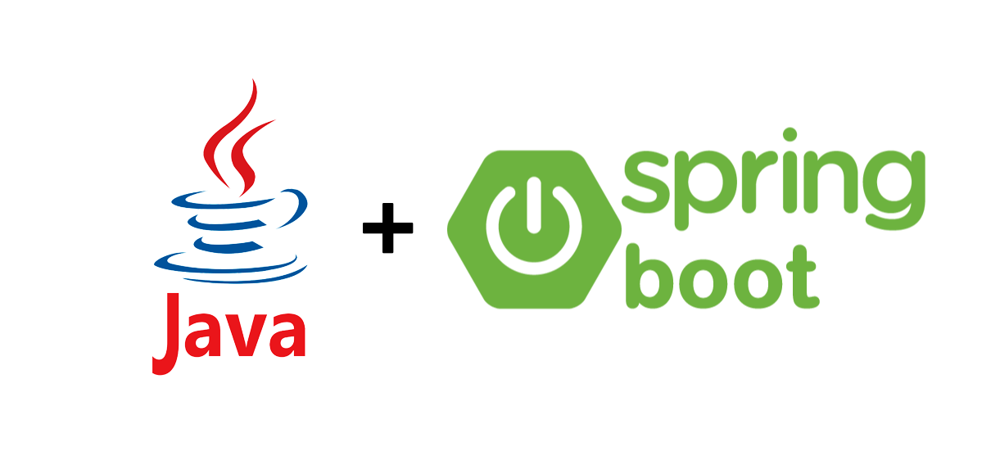

\pagenumbering{Roman}
\pagebreak
&nbsp;
\newpage

\begin{flushright}
\textit{Dedico este trabajo a mis padres por su apoyo y dedicación,} \\
\textit{a mis tutor de proyecto Micael Gallego,} \\
\textit{y a todas los amigos que sin darme cuenta} \\
\textit{han estado ahí}.
\end{flushright}

\newpage
&nbsp;

\tableofcontents

\pagebreak
&nbsp;
\newpage

\pagebreak
&nbsp;
\newpage

# Resumen {-}

<!-- TODO -->

Aqui ira un resumen (al final)

\pagebreak
&nbsp;
\newpage

\pagenumbering{arabic}

# Introducción

En la actualidad en muchos centros educativos, universidades y escuelas, los profesores utilizan ordenadores para hacer sus presentaciones en clase, incluso centrándose unicamente en el contenido que aparece por la pantalla o el proyector como es el caso de los profesores dentro del área de la informática.

Una de las ventajas que presenta realizar las presentaciones y las clases con un ordenador, es poder grabar dichas clases y después dejarlas a disposición de los alumnos, para que cada uno pueda volver a ver las clases a su ritmo, pudiendo revisar todo el contenido de las mismas. Además, grabar las diapositivas y el contenido realizado en el ordenador, es muy útil para la creación de cursos online, permitiendo incluso la ausencia presencial de los alumnos, pudiendo llevar el conocimiento mucho más allá del lugar en el que se imparte.

Sin embargo, grabar las clases, editarlas y ponerlas a disposición de los alumnos no es una tarea trivial. Requiere un tiempo que los profesores no pueden utilizar para la preparación del contenido de sus clases, pudiendo incluso influenciar en la calidad de las mismas. Para solventar este tiempo dedicado a la grabación, edición y publicación de las clases surge *Class Recorder*.

A continuación, en los siguientes apartados de este capítulo, se abordarán los diferentes problemas con los que los docentes y profesores se encuentran a la hora de grabar sus clases, estudiaremos como mejorar las partes que mayor esfuerzo conllevan, a que usuarios esta enfocada está aplicación y se explicará a grandes rasgos el software presentado.

## Contexto y estudio del problema

Para entrar un poco en el contexto y la problemática a la hora de grabar las clases con un ordenador, se va a exponer a continuación los problemas más comunes.

Lo más importante al principio es preparar el contenido del curso o de la asignatura, como diapositivas, ejemplos, proyectos, etc. Esto supone un tiempo y esfuerzo necesario para que las clases tengan cierta calidad. El tiempo que dedique un profesor a la preparación del contenido de sus clases es directamente proporcional a la calidad de las mismas. Complementar entonces este esfuerzo grabando cada una de las sesiones impartidas, le otorga al curso más flexibilidad y le da la posibilidad a todo el alumnado de ir a su propio ritmo.

El problema que surge a la hora de grabarlas, son en su mayor parte, debido a la multitud de herramientas de las que se disponen para grabar el contenido, y la distracción que provoca en el profesor el utilizarlas, reduciendo el tiempo dedicado a la enseñanza y la calidad de la lección. A esto hay que añadir el aprendizaje de dichas herramientas, las cuales suelen ser bastante complejas por lo general, con información excesiva acerca de los formatos de los vídeos, configuraciones de vídeo y audio, etc.

Otro aspecto que puede ser problemático, es la grabación del audio de las clases. En su mayor parte, las clases se imparten de pie, leyendo y explicando diapositivas, por lo que en algunas ocasiones el micrófono del ordenador se encuentra lejos de la fuente de voz, por lo que la calidad del audio tiende a empeorar a medida que nos alejamos de este. Esto se suele solventar grabando el audio con un dispositivo móvil y después uniendo vídeo y audio, pero esto solo añadiría aún más carga de trabajo para producir el vídeo final.

A esto hay que sumarle la edición de vídeo, desechar de este las partes irrelevantes, los descansos o interrupciones, etc. El profesor debe entonces aprender y elegir probablemente otra herramienta con la que editar dicho vídeo, contando con multitud de software (en muchas ocasiones de pago), que se utilizan de forma diferente, desviando el tema principal, que es enseñar. Además los vídeos tras editarlos, hay que renderizarlos y subirlos.

Al final nos encontramos con un proceso bastante tedioso, que lleva un aprendizaje detrás para el profesor bastante costoso, que le separa de su objetivo final. En la Figura \ref{proc_comun} se puede observar el proceso común y las opciones que tiene un profesor para grabar sus clases.

{#proc_comun}

\pagebreak

## Motivaciones.

La principal motivación es reducir toda esa carga de trabajo adicional, y optimizar al máximo el tiempo necesario para grabar las clases, mejorando además los problemas mencionados en el apartado anterior.

Al final nos encontramos con que tenemos que reducir el consumo de tiempo y mejorar las siguientes tareas:

- Aprendizaje de herramientas para grabación.
- Grabación de audio por separado
- Identificar zonas en las que realizar cortes en el vídeo o juntar vídeos.
- Renderización y subida a una plataforma.

Hay que tener en cuenta que muchas de las herramientas que se utilizan comúnmente para la edición de vídeos y grabación de escritorio, son herramientas que abarcan muchos casos de uso, y que tienen funcionalidad extra, que el profesor no necesita conocer, y que pueden confundir a la hora de realizar los vídeos.

Una posible solución es la unificación del flujo de trabajo, utilizando un software unicamente para la realización de las grabaciones y simplificando la edición y grabación de vídeo únicamente a lo necesario por un profesor para grabar sus clases. Si observamos detenidamente la Figura \ref{proc_comun}, el proceso de grabación no consiste en la realización de un conjunto de pasos definidos ya que se debe elegir el software que quiere utilizar, aprenderlo, pero no hay un camino claro para alcanzar el objetivo concreto.

La motivación principal de *Class Recorder* es acabar con esta fragmentación y unificar todo el proceso en uno solo, para facilitar todo el trabajo y crear una sola plataforma con la que poder grabar, editar y subir vídeos, restando el tiempo innecesario de edición y grabación proporcionando herramientas fáciles de usar y enfocadas a la tarea en cuestión. Son muchas opciones, para llegar al mismo objetivo, que es grabar nuestras clases de la forma más cómoda posible al mismo tiempo que maximizamos el tiempo dedicado a las clases.

Queremos que el usuario pase de usar múltiples aplicaciones y herramientas, a que solo utilice una que esté enfocada exclusivamente en el objetivo principal del profesor y así poder distribuir sus clases de forma rápida y eficaz.

En la Figura \ref{proc_crecorder} podemos ver como se simplifica el proceso, utilizando unicamente *Class Recorder* en comparación con el visto en la Figura \ref{proc_comun}. En las siguiente sección se explicará la aplicación final a la que se quiere llegar y el flujo de trabajo objetivo para optimizar este proceso.

{#proc_crecorder}

# Objetivos y solución propuesta

En este proyecto proponemos una unica solución para la realización de todo este proceso de grabación y distribución de clases. Es importante recalcar que nuestro objetivo principal y el propuesto con este proyecto es crear un único flujo de trabajo, mediante las siguientes herramientas software que hemos creado:

- Aplicación de escritorio, con el que controlar (grabar, pausar), gestionar, cortar y subir los videos realizados.
- Aplicación móvil sincronizada con la aplicación de escritorio con la que controlar las grabaciones, grabar el audio y poder controlar las diapositivas.

El usuario ya no tiene que elegir entre decenas de herramientas software incompatibles muchas veces incompatibles entre sistemas operativos. En este proyecto ofrecemos una aplicación compatible, tanto en Windows como en GNU/Linux, y esta preparada para en un futuro tener soporte para Mac OS como podremos ver en el apartado \ref{dis_e_imp} de diseño e implementación.

El usuario podrá elegir entre:

1. Realizar una sesión desde el propio ordenador y grabar unicamente la pantalla y la voz desde el micrófono del mismo.
2. Realizar una sesión controlada desde el móvil y grabar el contenido de la pantalla del ordenador y grabar el audio desde el movil.

El primer caso es ideal para clases en las que el profesor está solo enfrente del ordenador grabándose a si mismo realizando una tarea o impartiendo una lección. El segundo es ideal para impartir clases con diapositivas ya que permite al profesor levantarse, hacer algunas indicaciones y seguir grabando con el móvil su voz.

Además tanto en el ordenador como en el móvil se puede pausar y continuar la grabación, que más tarde puede ser editada o subida directamente a Youtube de forma privada.

**Flujo de trabajo con ordenador**:

Si el profesor decide impartir la clase unicamente con el ordenador, unicamente deberá hacer lo siguiente.

1. Abrir *Class Recorder* en Windows/Linux.
2. Crear un curso (elegirlo si ya esta creado).
3. Iniciar grabación, unicamente poniendo un nombre para el video, un framerate y un formato de contenedor (mkv, mp4).

No es necesario configurar nada, en Windows y Ubuntu se detecta la pantalla principal y el micrófono por defecto. El profesor entonces podrá comenzar su charla o clase y podrá pausar el video en los momentos que quiera. En la figura \ref{flujo_trabajo_1} se puede ver el flujo de trabajo más claramente.

{#flujo_trabajo_1}

**Flujo de trabajo con ordenador y móvil**:

En muchas ocasiones la clase no se puede impartir sentado, es por eso que *Class Recorder* ofrece la posibilidad de controlar la grabación de la pantalla de nuestro ordenador, grabar el audio desde el móvil y además poder controlar las diapositivas desde el. El flujo de trabajo sería el siguiente:

1. Abrir *Class Recorder* en Windows/Linux.
2. Consultar desde la aplicación nuestra IP local.
3. Iniciar la App de *Class Recorder* y introducir nuestra IP local.
4. Comenzar a grabar.

Así de sencillo, y la app disponde de los mismos controles que la aplicación de escritorio. En la siguiente Figura \ref{flujo_trabajo_2} se puede ver más en detalle.

{#flujo_trabajo_2}

# Tecnologías, herramientas y metodologías

Antes de introducir las tecnologías que se han utilizado, es necesario comprender a grandes rasgos cómo esta estructurada la aplicación y cual es su arquitectura en general. No se ahondará en el diseño de la aplicación si no que se va a introducir a lo largo de este capítulo a grandes rasgos la arquitectura de la aplicación y las herramientas que hemos utilizado para gestionar el desarrollo, las pruebas y el por qué de cada decisión tecnológica. Podríamos dividir este capítulo en 6 subsecciones:

1. Metodología de desarrollo.

2. Lenguajes y frameworks utilizados para el desarrollo de la aplicación.

3. Organización de Repositorio y tecnologías para automatización de flujo de trabajo y CI/CD.

4. Entorno de desarrollo y de integración continua completamente dockerizado.

5. Tecnologías utilizadas para escribir esta memoria (Pandoc + Markdown)

6. Electron como plataforma final de producción.

## Metodología de desarrollo

El proyecto ha sido desarrollado por mi, unido a la continua retroalimentación de mi tutor. Se podría considerar que se ha utilizado la metodología de Scrum[@bib1], pero para los más puristas en cuanto a metodologías software no sería considerado como tal, ya que no se ha contado con el numero de personas suficientes para poder aplicar Scrum de la manera más eficiente posible, teniendo como Product Owner a mi tutor y yo mismo como Scrum Master y equipo de desarrollo. La propia guía de Scrum especifica que hay 3 roles diferentes: Product Owner, Equipo de desarrollo, y un Scrum Master. Además se dicta que el mínimo de personas necesarias para aplicar Scrum de la manera más eficaz es de 3 personas. Equipos de menos de 3 personas reduce la interacción y resulta en ganancias de productividad pequeñas. Sin embargo, sí que se han tenido reuniones pasadas ciertas semanas en el equipo para ver cómo ha ido avanzando el proyecto, retrospectivas, prototipos, integración, pruebas, etc. No obstante, como no aplicamos todas las reglas de Scrum, consideraremos que el desarrollo se está realizando con una metodología iterativa e incremental ágil tal y como se muestra en la Figura \ref{fig:incremental}.

{#fig:incremental .class width=10cm}

En este modelo, primero se realiza un análisis de los requisitos que se van a necesitar para cada iteración. Después del desarrollo de estos, se hacen pruebas y para finalizar se integra con el resto del sistema.

Cada 2 semanas se ha realizado una iteración donde se realizaron todos los pasos comentados anteriormente, donde todo se decidió qué historias de usuario eran más críticos e importantes y los bugs que se detectaron para resolverlos. En base a estas decisiones y utilizando herramientas online como Trello[^3], se gestionó que tareas debían realizarse en cada iteración.

[^3]: Es un tablero online donde se pueden crear, asignar y clasificar tareas, de tal modo que todo el equipo tiene una visión global del estado actual de desarrollo que se está creando.

Un desarrollo iterativo e incremental ofrece varias ventajas con respecto a otras metodologías como puede ser el desarrollo en cascada. Una de las ventajas que ofrece es la entrega de software que se puede usar a mitad de desarrollo, mientras que en el modelo en cascada cada fase del proceso debe ser finalizada (firmada) para pasar a la siguiente fase. El desarrollo de software no es lineal y esto crea dificultades si se utiliza una metodología en cascada[@bib2].

Cada cierto tiempo se han realizo releases. Utilizamos un formato de versiones semántico[@bib3] del tipo X.Y.Z donde, X, Y y Z son números enteros mayores que 0.

X se corresponde a la versión mayor (cambios grandes que modifican parte o gran parte de la funcionalidad). Y se corresponde a la versión menor(pequeños cambios, corrección de bugs) y Z, que son micro versiones (parches, pequeños bugs críticos...). Se han incorporado además de las prácticas ágiles más comunes un sistema de integración y despliegue continuo.

\pagebreak

## Lenguajes y frameworks utilizados para el desarrollo de la aplicación.

La aplicación está formada por tres partes principales:

1. Backend (Java + Spring + Ffmpeg)

2. Frontend PC (Angular)

3. Android App (Ionic)

Su organización a nivel de arquitectura y diseño se comentan en más profundidad en la sección \ref{archictecture}

### Backend (Java + Spring Boot + Ffmpeg)

Como lenguaje de servidor hemos decidido utilizar Java junto con Spring Boot. Las razones de por qué hemos utilizado Java como lenguaje de programación en el backend son:

- Es el lenguaje con el que más experiencia he acumulado y más proyectos he realizado.

- Es un lenguaje fuertemente tipado y robusto, lo cual lo hace facilmente escalable y entendible por terceros programadores que deseen continuar el proyecto.

- Multiplataforma.

Para esta aplicación necesitabamos ofrecer una API RESTful para realizar una aplicación web frontend con Angular y una aplicación con Ionic. Se decició utilizar Spring Boot por las siguientes razones:

- Inyección de dependencias: Spring cuenta con un poderoso inyector de dependencias con el que podemos realizar nuestra aplicación utilizando las mejores prácticas para que sea escalable y testeable, separando la lógica en servicios independientes.

- Spring Data: Abstrae el acceso a bases de datos, de tal forma que no tenemos tanto que preocuparnos por el acceso y manejo de los mismos.

- Controladores Rest: Spring Boot ofrece la posibilidad de crear controladores Rest de una forma muy sencilla.

{#java_springboot_logo .class width=8cm}

Pero al servidor Java hay que añadirle la parte central y más importante de nuestra aplicación: ffmpeg.

Ffmpeg es una herramienta multiplataforma (posee binarios para cada plataforma) que nos permite convertir videos y audio de un formato a otro. Ffmpeg ofrece un CLI el cual utilizaremos en nuestra aplicación Java para realizar las grabaciones del escritorio, cortar los videos, juntar el audio del movil con el video grabado en el pc, etc.

{#ffmpeg_logo .class width=6cm}

Haremos llamadas al sistema desde Java para la ejecución de Ffmpeg y controlaremos todo el proceso desde el mismo servidor. Se hablará de esto con mas detalle en la seccion \ref{dis_e_imp}

### Frontend PC y Android App (Angular + Ionic)

Como estamos desarrollando un servidor RESTFul podemos crear dos proyectos SPA que serán los siguientes:

- Frontend PC: Angular + TypeScript

- Android App: Ionic 3 + Angular + TypeScript

En ambos proyectos utilizamos Angular como framework para el frontend (el cual utiliza TypeScript). ¿Por qué utilizar el framework Angular frente a otras opciones como React y Vue? En primer lugar, al ser un framework y no una librería, un framework tiene mucho más clara la construcción y organización de un proyecto. Además con TypeScript el código es mucho más mantenible debido a su tipado estático. Eso unido a la estructura de componentes y servicios que ofrece Angular, dan una base muy sólida para comenzar un proyecto que pueda crecer a largo plazo.

Por otro lado, Ionic es un framework que nos permite crear aplicaciones híbridas nativas para móbiles utilizando tecnologías web. Utilizando el framework de Angular y librerias que ofrece Ionic para utilizar elementos hardware del dispositivo móvil, podemos crear una aplicación móvil completa para la tarea que se quiere realizar. Ionic hace llamadas a las API's de cordova, que son un conjunto de librerías que permiten interactuar con el hardware móvil. Cordova ofrece una API javascript e Ionic encapsula este comportamiento mediante servicios que son facilmente utilizables dentro de Ionic.

{#frontend_logos .class width=9cm}

## Organización de Repositorio y Task Managing

Este proyecto podría considerarse que está utilizando una organización monorepositiorio con tres partes principales que ya comentamos en la sección anterior.

Para organizar nuestro proyecto he utilizado Git como control de versiones y GitHub como repositorio remoto.

Para gestionar las builds y los scripts de test, hemos utilizado gulp, una librería de NodeJS, que nos permite automatizar tareas repetitivas tales como copiar ficheros al hacer builds, compilar en diferentes entornos, minificación de código, logs, etc. Gulp nos permite crear y organizar dichas tareas repetitivas para poder ejecutarlas desde una terminal o poder automatizar los builds y la ejecución de test de una forma organizada y relativamente sencilla. 

{#fig:gulp .class width=1.5cm}

Gulp permite crear tareas indivuales (que pueden ser builds, test, minificaciones) de tal modo que podemos encadenar tareas de una forma bastante sencilla y cómoda.

En la raíz del repositorio se encuentran los scripts más generales para compilar toda la arquitectura, pero gulp no es el único que hace todo el trabajo de automatización de builds y test. Cada proyecto individual utiliza sus propias herramientas de gestión y organiza también sus propios scripts. Por ejemplo:

- Backend: Maven

- Frontend: Angular-cli + npm + Node

- Ionic: Ionic-cli + npm + Node

Al final el proposito de gulp, es llamar a los scripts correspondientes para hacer las builds y los test de cada proyecto independiente de nuestro repositorio, y organizar todos los ficheros compilados en una unica carpeta `build/` en la que se encontrará nuestra aplicación final. 

En definitiva, con gulp creamos un conjunto de scripts que nos abstrae en cierta medida de tener que utilizar angular-cli, ionic-cli, maven, etc. De esta forma se puede ejecutar, compilar o hacer test de nuestra aplicación con un solo comando desde la carpeta raíz. Para ejecutar gulp, necesitamos node y npm, por lo que en la carpeta raíz de nuestro proyecto, tenemos en un fichero `package.json` definidos todos los scripts necesarios para nuestro proyecto. 

Por ejemplo para instalar las dependencias y ejecutar el servidor, solo es necesario ejecutar:

>

```
npm run install-dependencies
npm run dev:start-pc-server
```

>

>

{#fig:gulp_workflow .class width=11cm}

En la Figura \ref{fig:gulp_workflow} se puede ver a grandes rasgos como gulp (ejecutado y gestionado con node y npm) actúa con los proyectos de nuestro repositorio.  Todos los spripts definidos en el `package.json` pueden ser utilizados tanto por los desarrolladores como el entorno de CI/CD, agilizando el proceso de desarrollo.

En el Anexo 1 se puede ver además de una guía de configuración para el entorno de desarrollo, una lista con los scripts para compilar y ejecutar el proyecto.

Como sistema de CI/CD hemos utilizado travis. El sistema de CI/CD podría perfectamente ejecutarse en travis sin Docker, pero para tener un mayor control de las versiones que utilizamos, las configuraciones del sistema y tener un sistema en el que desarrollar homogéneo, decidimos utilizar Docker. En la siguiente sección explicaremos en más detalle cómo está montado el sistema de CI/CD junto con el uso de Docker.

## Entorno de desarrollo y de integración continua completamente dockerizado.

Al desarrollar este proyecto me encontré con ciertas problemáticas. Una de ellas es la tediosidad de configurar todo el entorno para ponerse a desarrollar, y más teniendo en cuenta la utilización de ffmpeg y la instalación de Android SDK para poder crear la aplicación de Ionic. En los momentos en los que desarrollaba esta aplicación, tenía a mi disposición varios ordenadores, y tenía que configurarlos todos para poder desarrollar o corregir un simple bug. Si tenía un ordenador en la oficina, ¿por qué tenía que llevarme el portátil?. Si tenía un problema con el sistema, tenía que reconfigurar todo el entorno, y quería poder tener un sistema universal para poder desarrollar en cualquier ordenador que tuviera a mano.

Para esto se me presentaron varias posibles soluciones:

1. Crear una maquina virtual y configurar el entorno dentro para desarrollar

2. Configurar un servidor y desarrollar a través de él.

3. Dockerizar el entorno de desarrollo y levantar una infraestructura docker para desarrollar dentro de los contenedores.

Si no hubera conocido Docker, la primera opción hubiera sido la más factible, pero podía aprovechar un poco mejor los recursos con Docker. La segunda opción no era tan viable ya que por aquel entonces no existian herramientas lo suficientemente sólidas como para desarrollar desde un servidor. Eclipse Che era una opción pero no podía desarrollar Angular con él. Ahora existen servidores web como Code Server[^2] u opciones del propio Visual Studio Code que te permiten desarrollar en remoto por ssh.[^3] Las otras opciones consistian en instalar en un servidor un Linux con un sistema de ventanas, ya que necesitaba grabar el escritorio de Linux con ffmpeg, y desarrollar a través de una conexión por VNC no era una opción para mí.

Por eso me decante por la opción número 3. Decidí dockerizar todo lo necesario para desarrollar, incluidos programas de desarrollo como VSCode e IntelliJ, Android SDK, OpenJDK, ffmpeg y todo lo necesario en una misma imagen de docker. Esto además me permitió compartir dicha imagen con el entorno de integración, teniendo un sistema inmutable para desarrollar, testear y hacer las builds.

{#docker_logo .class width=6cm}

La imagen docker comparte ciertos sockets de X11[@bib13] y de pulseaudio[@bib14] con el sistema operativo host e incorpora todas las IDE's y herramientas necesarias para desarrollar. En la siguiente imagen se puede ver un esquema visual de lo anteriormente explicado.

>

{#ci-cd-env .class width=13cm}

[^2]: Code Server: https://coder.com/

[^3]: Realizar desarrollo remoto con VSCode por ssh https://code.visualstudio.com/docs/remote/ssh

De esta forma, podemos ponernos a desarrollar simplemente teniendo una máquina con ubuntu y docker instalado. En el Anexo 1 se puede ver como utilizar este entorno para desarrollar más detenidamente. Pero para demostrar la comodidad que puede suponer está configuración, estos son los comandos necesarios para ponerse a desarrollar en cualquier máquina con Ubuntu.

```
git clone https://github.com/Class-Recorder/docker-class-recorder
cd docker-class-recorder/docker-runnables/crecorder-dev
./docker_run.sh
```

Con estás instrucciones levantamos la infraestructura necesaria para desarrollar. Una vez estan ejecutados los contenedores, el desarrolador debería ejecutar:

```
docker exec -it crecorder-dev_teacher-pc-server_1 /bin/bash
code class-recorder
```

Esto le abrirá un VSCode con todo listo para programar, hacer builds, testing, etc. No es necesario instalar absolutamente nada, el script `docker_run.sh` ejecuta un `docker compose` descargando las imagenes necesarias para desarrollar. El único inconveniente que puede tener esta solución es el tamaño final de la imagen (7.44 GB). Incluso se puede conectar un dispositivo Android y este sería detectado perfectamente ya que la imagen comparte los dispositivos usb y lleva incorporada una version de Android SDK y ADB. 

## Tecnologías utilizadas para escribir esta memoria (Pandoc + Markdown)

## Electron como plataforma final de producción.

&nbsp;
\newpage

# Descripción informática

**25 a 35 páginas**

\pagebreak
&nbsp;
\newpage

## Requisitos

### Requisitos funcionales

Las historias de usuarios que consisten en una serie de comportamientos o módulos que deben ser integrados en el sistema de simulación y son los siguientes:

**Requisito funcional 1**

**Requisito funcional 2**

**Requisito funcional 3**

**Requisito funcional 4**

**Requisito funcional 5**

**Requisito funcional 6**

**Requisito funcional 7**

**Requisito funcional 8**

### Requisitos no funcionales

**Requisito no funcional 1**

**Requisito no funcional 2**

**Requisito no funcional 3**

**Requisito no funcional 4**

\pagebreak
&nbsp;
\newpage

## Arquitectura y análisis {#archictecture}

\pagebreak
&nbsp;
\newpage

## Diseño e implementación {#dis_e_imp}

\pagebreak
&nbsp;
\newpage

## Pruebas

\pagebreak
&nbsp;
\newpage

# Conclusiones y trabajos futuros

**2 a 4 páginas**

\pagebreak
&nbsp;
\newpage

# Referencias

<div id="refs"></div>

\thispagestyle{plain}

\pagebreak
&nbsp;
\newpage

# Anexos

## Anexo 1

\pagebreak
&nbsp;
\newpage

## Anexo 2

\pagebreak
&nbsp;
\newpage

## Anexo 3

\pagebreak
&nbsp;
\newpage

## Anexo 4

\pagebreak
&nbsp;
\newpage
